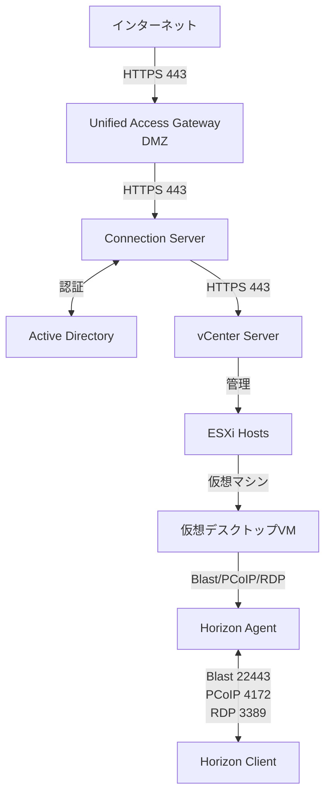
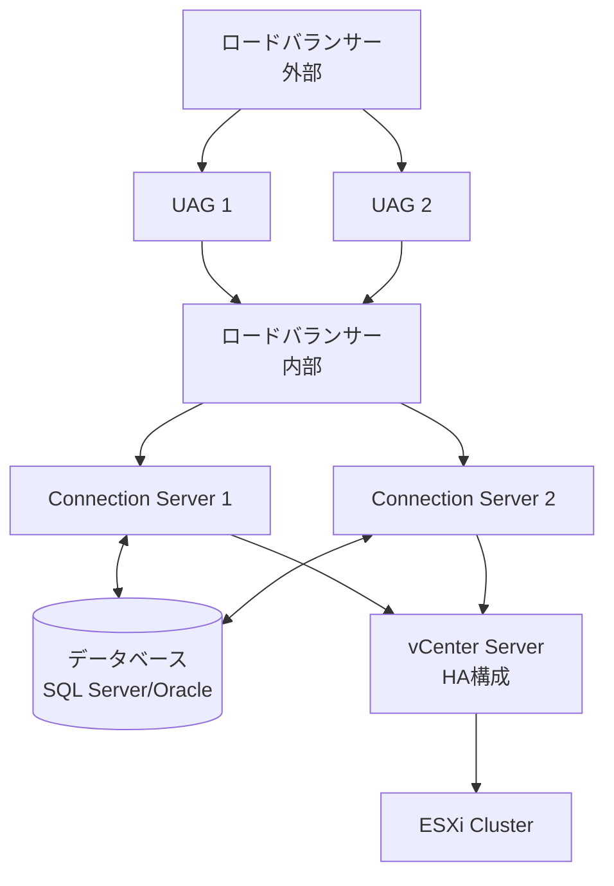
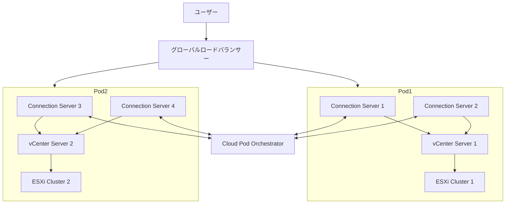
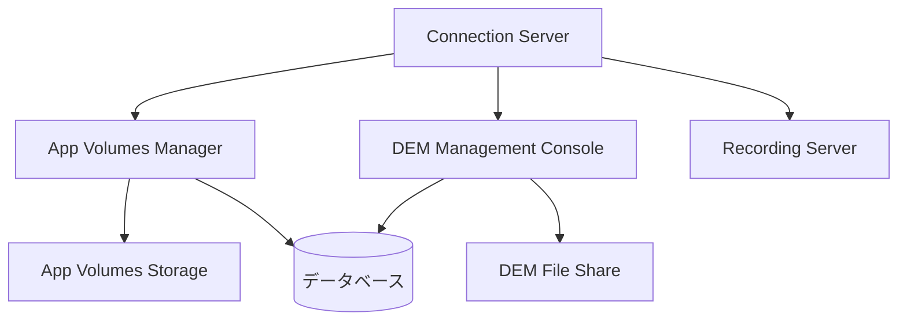

# 製品概要とアーキテクチャ

## Omnissa Horizonの製品概要

Omnissa Horizonは、仮想デスクトップとアプリケーションを安全に配信するための包括的な仮想デスクトップインフラストラクチャ（VDI）ソリューションです。Horizonを使用することで、組織はユーザーに安全で柔軟なデスクトップとアプリケーションのアクセスを提供できます。

### 主要な機能

- **仮想デスクトップ配信**: Windows、Linux、サーバーOSベースの仮想デスクトップの配信
- **アプリケーション配信**: 公開アプリケーションとRDSHベースのアプリケーション配信
- **セキュアアクセス**: Unified Access Gateway（UAG）による安全なリモートアクセス
- **プロファイル管理**: Dynamic Environment Manager（DEM）によるユーザープロファイルと環境の管理
- **アプリケーション管理**: App Volumesによるアプリケーションの動的配信
- **モニタリングと最適化**: パフォーマンス監視と最適化ツール
- **クラウドポッドアーキテクチャ**: 複数サイトの統合管理
- **セッション記録**: Recording Serverによるセッション記録
- **インテリジェンス統合**: Omnissa Intelligenceによる分析とレポート

## Horizon 8のアーキテクチャ

### アーキテクチャの概要

Horizon 8は、複数のコンポーネントが連携して動作する分散アーキテクチャを採用しています。これらのコンポーネントは、仮想デスクトップとアプリケーションの配信、管理、セキュリティを提供します。

### 主要コンポーネント

#### Connection Server

Connection Serverは、Horizon環境の中核となるコンポーネントです。以下の機能を提供します：

- ユーザー認証と認可
- デスクトップとアプリケーションのブローカー機能
- セッション管理
- ポッドとサイトの管理
- 管理コンソールの提供
- グローバル設定の管理

**特徴**:

- 複数のConnection Serverを配置して高可用性を実現
- レプリケーショングループで設定を同期
- Active Directoryと統合
- FIPS 140-2モード対応（オプション）

:::important
Connection Serverの設定は、デスクトッププールのパフォーマンスに直接影響を与えます。グローバル設定の最適化が重要です。
:::

#### Unified Access Gateway (UAG)

UAGは、Horizon環境への安全な外部アクセスを提供するエッジサービスです：

- SSL VPN機能
- リバースプロキシ
- 認証の統合（SAML、RADIUS、RSA、スマートカード）
- セキュリティポリシーの適用
- 負荷分散
- FIPS 140-2モード対応（オプション）

**配置**:

- DMZに配置して外部からのアクセスを受け入れる
- 複数のUAGを配置して高可用性を実現
- ロードバランサーと統合（推奨：1:1比率でConnection Serverと統合）

**デプロイ方法**:

- Multi-NIC構成
- PowerShellスクリプトによる自動デプロイ
- UIによる手動デプロイ

#### Enrollment Server

Enrollment Serverは、モバイルデバイスの登録を管理します：

- デバイス登録の管理
- Workspace ONE UEMとの統合
- デバイス証明書の管理

#### Access Connector

Access Connectorは、Horizon環境への接続を提供するコンポーネントです：

- モバイルデバイス管理（MDM）との統合
- デバイス認証
- 条件付きアクセス

#### Horizon Agent

Horizon Agentは、仮想デスクトップやRDSHホストにインストールされるエージェントです：

- クライアントとの通信
- 表示プロトコル（Blast、PCoIP、RDP）の処理
- セッション管理
- ローカルリソースのリダイレクト
- USBデバイスのリダイレクト
- Instant Cloneサポート

**対応OS**:

- Windows Desktop OS
- Windows Server OS
- Linux OS

#### Horizon Client

Horizon Clientは、エンドユーザーが仮想デスクトップやアプリケーションにアクセスするためのクライアントソフトウェアです：

**対応プラットフォーム**:

- Windows
- macOS
- iOS
- Android
- Linux
- Chrome OS
- Webブラウザ（HTML Access）

**機能**:

- デスクトップとアプリケーションへの接続
- ローカルリソースの使用
- マルチモニターサポート
- オーディオ/ビデオのリダイレクト

#### vCenter Server

vCenter Serverは、VMware vSphere環境の管理プラットフォームです：

- 仮想マシンのライフサイクル管理
- リソースプールとクラスターの管理
- ストレージ管理
- ネットワーク管理
- 高可用性（HA）とDRSの設定

#### App Volumes Manager

App Volumes Managerは、アプリケーションの動的配信を管理します：

- アプリケーションパッケージの作成と管理
- ユーザーとマシンへのアサイン
- 書き込み可能ボリュームの管理
- ライフサイクル管理
- レプリケーション管理
- ストレージアクセスモードの設定

**高可用性**:

- 複数のApp Volumes Managerのインストールと登録
- SQL Server Always On、Oracle RACなどの高可用性データベース

#### Dynamic Environment Manager (DEM)

DEMは、ユーザー環境とプロファイルを管理します：

- ユーザープロファイルの管理
- 環境設定の適用
- フォルダリダイレクション
- アプリケーション設定の同期
- 条件付きポリシー（Smart Policies）
- 条件セット（モジュラーアプローチ）

**デプロイメント**:

- ファイル共有の設定
- Management Consoleのインストール（NoAD含む）
- ADMXテンプレートのインポート

#### Recording Server

Recording Serverは、ユーザーセッションを記録します：

- ローカルセッションの記録
- リモートセッションの記録
- グループベースの記録設定
- 記録データの保存と管理

**ユースケース**:

- コンプライアンス要件への対応
- セキュリティ監査
- トレーニングとサポート

#### Edge Gateway

Edge Gatewayは、Omnissa Intelligenceにデータを送信します：

- Horizon環境のメトリック収集
- Omnissa Intelligenceへのデータ送信
- DEEMエージェントとの連携

## ネットワークアーキテクチャ

### ネットワークコンポーネント

#### 内部ネットワーク

- **管理ネットワーク**: Connection Server、vCenter Server、データベース間の通信
- **仮想マシンネットワーク**: 仮想デスクトップとRDSHホストのネットワーク
- **ストレージネットワーク**: ストレージへのアクセス（必要に応じて）

#### 外部ネットワーク

- **クライアントアクセス**: UAGを経由した外部からのアクセス
- **インターネット接続**: ライセンスサーバーや更新サーバーへの接続

### ネットワークポート

主要なネットワークポート：

- **Connection Server**: 443（HTTPS）、4001（JMS）、4100（View Composer、Horizon 8では非推奨）
- **UAG**: 443（HTTPS）、4172（PCoIP）、22443（Blast）、9443（管理）
- **Horizon Agent**: 4172（PCoIP）、22443（Blast）、3389（RDP）
- **vCenter Server**: 443（HTTPS）、902（Heartbeat）
- **Enrollment Server**: 443（HTTPS）
- **Recording Server**: 443（HTTPS）、902（録画データ転送）
- **Edge Gateway**: 443（HTTPS、Omnissa Intelligenceへの接続）

詳細は[クイックリファレンス](../00_Quick_Reference.md)を参照。

### ネットワーク設計の考慮事項

- 帯域幅の要件
- レイテンシの要件
- ファイアウォールルール
- 負荷分散の設定
- ネットワークセグメンテーション
- UAGセッションプロトコルのファイアウォール設定

:::tip
UAGとConnection Serverの統合では、1:1比率を維持することがベストプラクティスです。これにより、パフォーマンスと管理性が向上します。
:::

## ストレージアーキテクチャ

### ストレージタイプ

#### 仮想マシンデータストア

- **VMFS**: vSphereの従来のファイルシステム
- **NFS**: ネットワークファイルシステム
- **vSAN**: ハイパーコンバージドストレージ

#### ストレージプロファイル

- **永続デスクトップ**: ユーザーデータを保持するストレージ
- **非永続デスクトップ**: Instant Clone用のストレージ
- **ゴールデンイメージ**: マスターイメージ用のストレージ
- **App Volumes**: AppStackとWritable Volume用のストレージ

### ストレージ設計の考慮事項

- IOPS要件（Boot Storm、Logon Stormを考慮）
- 容量要件
- 可用性と冗長性
- コスト最適化
- ストレージ階層化
- App Volumesレプリケーション用ストレージ要件

:::warning
Boot StormやLogon Stormが発生する場合、ストレージIOPSが大幅に増加します。適切なストレージ設計とキャッシング戦略が必要です。
:::

## 高可用性の概念

### Connection Serverの高可用性

- **レプリケーショングループ**: 複数のConnection Serverで設定を同期
- **ロードバランサー**: クライアント接続の分散
- **Active Directory統合**: 認証の冗長性
- **データベースの高可用性**: SQL Server Always On、Oracle RAC

### UAGの高可用性

- **複数のUAGインスタンス**: アクティブ/アクティブまたはアクティブ/パッシブ構成
- **ロードバランサー**: 外部トラフィックの分散
- **ヘルスチェック**: 障害検出と自動フェイルオーバー
- **UAG HA**: UAG独自の高可用性機能

### App Volumesの高可用性

- **複数のApp Volumes Manager**: 追加Managerのインストールと登録
- **高可用性データベース**: SQL Server Always On、Oracle RAC
- **ストレージレプリケーション**: パートナーとのレプリケーション設定

### DEMの高可用性

- **複数のファイル共有**: 冗長なファイル共有の設定
- **Management Consoleの高可用性**: 複数のManagement Consoleの配置

### vSphereの高可用性

- **vSphere HA**: ホスト障害時の自動VM再起動
- **vSphere DRS**: リソースの動的分散
- **vSphere FT**: フォールトトレランス（限定的な用途）

### データベースの高可用性

- **Microsoft SQL Server Always On**: 高可用性グループ
- **Oracle RAC**: Real Application Clusters
- **データベースクラスタリング**: 複数のデータベースインスタンス

## クラウドポッドアーキテクチャ

### クラウドポッドの概念

クラウドポッドアーキテクチャ（CPA）は、複数のHorizonポッドを単一の管理ドメインに統合するアーキテクチャです。

### クラウドポッドの構成要素

- **Cloud Pod Orchestrator**: グローバルエンタイトルメントとロードバランシング
- **複数のポッド**: 地理的に分散したHorizon環境
- **グローバルエンタイトルメント**: 複数ポッドにまたがるユーザーアクセス
- **グローバルロードバランシング**: 最適なポッドへの接続ルーティング
- **グローバルLDAPインスタンス**: フェデレーション全体で使用されるLDAP
- **ローカルLDAPインスタンス**: 各ポッドで使用されるLDAP

### クラウドポッドの利点

- **地理的分散**: 複数のデータセンターやリージョンに展開
- **災害復旧**: 一つのポッドが障害時も他のポッドでサービス継続
- **リソース最適化**: グローバルなリソースプールの活用
- **スケーラビリティ**: 複数ポッドでの容量拡張
- **Home Site戦略**: ユーザーの位置に基づく最適なポッドへの接続

### クラウドポッドの設計考慮事項

- ネットワーク接続性
- レイテンシ要件
- データレプリケーション
- グローバルエンタイトルメントの設計
- フェデレーション認証
- サイト設定オプション
- アップグレードプロセスと依存関係

:::important
Cloud Pod Architectureでは、グローバルLDAPインスタンスとローカルLDAPインスタンスの違いを理解することが重要です。グローバルLDAPはフェデレーション全体で使用され、ローカルLDAPは各ポッドで使用されます。
:::

## コンポーネント間の通信フロー

### ユーザー接続フロー

1. **クライアントからUAGへの接続**
   - クライアントがUAG（ポート443）にHTTPS接続
   - UAGが認証を処理（Active Directory、SAML、RADIUSなど）

2. **UAGからConnection Serverへの接続**
   - UAGが認証済みリクエストをConnection Server（ポート443）に転送
   - Connection Serverがユーザー認証を検証

3. **Connection ServerからvCenter Serverへの接続**
   - Connection ServerがvCenter Server（ポート443）に接続
   - 仮想マシンの状態確認と割り当て

4. **クライアントから仮想マシンへの接続**
   - Connection Serverが仮想マシン情報をクライアントに返送
   - クライアントがHorizon Agent（ポート22443 Blast、4172 PCoIP、3389 RDP）に直接接続

### 管理操作フロー

1. **管理コンソールからConnection Server**
   - 管理者がHorizon Console（ポート443）に接続
   - Connection Serverが管理操作を処理

2. **Connection ServerからvCenter Server**
   - プール作成、VM管理などの操作をvCenter Serverに送信
   - vCenter Serverが操作を実行

3. **Connection Serverからデータベース**
   - 設定情報、エンタイトルメント、セッション情報をデータベースに保存・取得

### Cloud Pod Architectureの通信フロー

1. **グローバルエンタイトルメントへの接続**
   - ユーザーがGlobal Entitlementに接続
   - Cloud Pod Orchestratorが最適なポッドを決定
   - ユーザーが選択されたポッドのConnection Serverに接続

2. **Home Site戦略**
   - ユーザーの位置に基づいてHome Siteが決定
   - 可能な限りHome Siteのポッドに接続

## アーキテクチャ図

### 基本的なHorizon環境

### 高可用性構成

### Cloud Pod Architecture

### 統合アーキテクチャ（App Volumes、DEM、Recording Server）

## 理解度チェックリスト

以下の項目について理解度を確認してください：

### 基本概念
- [ ] Omnissa Horizonの主要機能を説明できる
- [ ] Horizon 8のアーキテクチャの概要を理解している
- [ ] 主要コンポーネント（Connection Server、UAG、Agent、Client）の役割を説明できる

### コンポーネント
- [ ] Connection Serverの機能と特徴を説明できる
- [ ] UAGの役割と配置場所を理解している
- [ ] Enrollment ServerとAccess Connectorの役割を理解している
- [ ] Horizon AgentとHorizon Clientの違いを説明できる
- [ ] vCenter Server、App Volumes Manager、DEMの役割を理解している
- [ ] Recording ServerとEdge Gatewayの役割を理解している

### ネットワーク
- [ ] 主要なネットワークポート番号を覚えている
- [ ] コンポーネント間の通信フローを理解している
- [ ] ネットワーク設計の考慮事項を説明できる
- [ ] UAGセッションプロトコルのファイアウォール設定を理解している

### 高可用性
- [ ] Connection Serverの高可用性実装方法を理解している
- [ ] UAGの高可用性構成を説明できる
- [ ] App VolumesとDEMの高可用性オプションを理解している
- [ ] vSphereの高可用性機能を理解している

### クラウドポッドアーキテクチャ
- [ ] クラウドポッドアーキテクチャの概念を理解している
- [ ] クラウドポッドの利点を説明できる
- [ ] クラウドポッドの設計考慮事項を理解している
- [ ] グローバルLDAPインスタンスとローカルLDAPインスタンスの違いを説明できる
- [ ] Home Site戦略を理解している

### ストレージ
- [ ] Boot StormとLogon Stormの影響を理解している
- [ ] App Volumesレプリケーション用ストレージ要件を理解している
- [ ] ストレージ設計の考慮事項を説明できる

## まとめ

Omnissa Horizonは、複数のコンポーネントが連携して動作する包括的なVDIソリューションです。Connection Server、UAG、Agent、Clientなどの主要コンポーネントを理解し、ネットワーク、ストレージ、高可用性の設計を適切に行うことで、堅牢でスケーラブルなHorizon環境を構築できます。クラウドポッドアーキテクチャを活用することで、地理的に分散した環境でも統合管理が可能になります。

各コンポーネント間の通信フローとポート番号を理解することで、ネットワーク設計とトラブルシューティングが容易になります。適切なアーキテクチャ設計により、セキュアで高性能なHorizon環境を実現できます。

OCE-Hレベルでは、これらのコンポーネントの高度な設定、統合、トラブルシューティングの知識が求められます。
