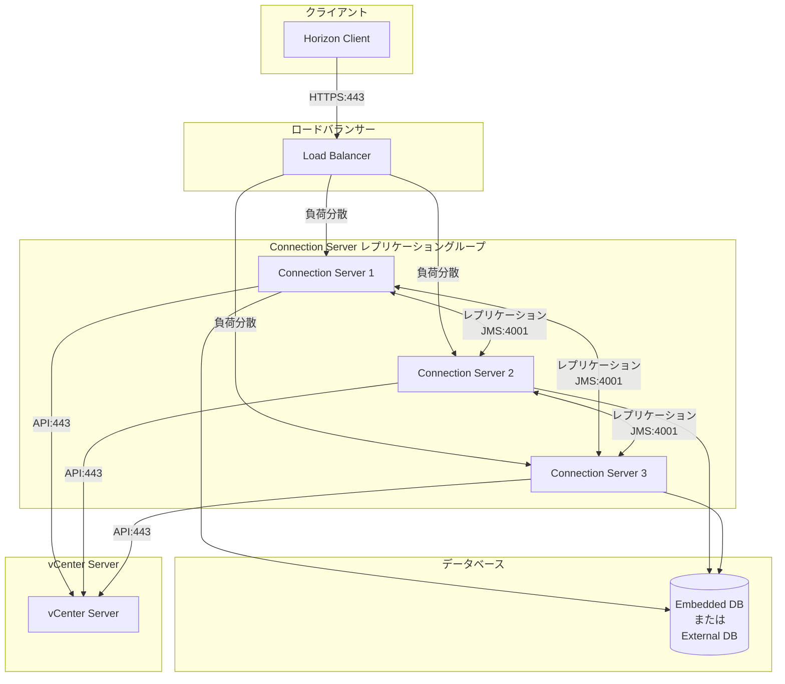
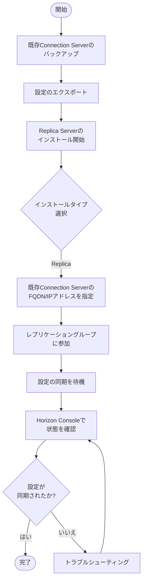

# 1.1 Connection Servers, Enrollment Servers, and Access Connectors

## 概要

Connection Server、Enrollment Server、Access Connectorは、Horizon環境の中核コンポーネントです。OCE-Hレベルでは、これらのコンポーネントの高度な設定、マルチノード環境での高可用性構成、パフォーマンス最適化が求められます。

## 学習目標

このセクションを学習することで、以下のことができるようになります：

- マルチノード環境でのConnection Serverの高可用性構成を実装できる
- ロードバランシングの設定と最適化ができる
- グローバル設定（load balancing, security protocols, certificates）を最適化できる
- Connection Server設定がデスクトッププールパフォーマンスに与える影響を評価できる
- Enrollment ServerとAccess Connectorのインストールと設定ができる
- パフォーマンスメトリックの監視とトラブルシューティングができる

## 関連リソース

- [クイックリファレンス](../../00_Quick_Reference.md) - ポート番号、設定値、制限値
- [用語集](../../README.md#用語集) - 関連用語の定義
- [1.2 Planning Horizon Deployments](1.2_Planning_Horizon_Deployments.md) - デプロイメント計画
- [1.9 Resource Allocation and Load Balancing](1.9_Resource_Allocation_Load_Balancing.md) - ロードバランシング
- [実環境シナリオ](../../00_Scenarios/Section1_Scenarios.md) - 実環境でのシナリオ例

## Connection Serverの高度な設定

### マルチノード環境での高可用性構成

#### レプリケーショングループの構成

複数のConnection Serverをレプリケーショングループに追加することで、高可用性を実現します。

**推奨構成**:
- 最小2台、推奨3-5台のConnection Server
- 各Connection Serverは同じデータベースを共有
- ロードバランサーを配置してクライアント接続を分散

#### アーキテクチャ図



**Replica Serverの追加手順**:



1. **既存Connection Serverのバックアップ**
   ```powershell
   # 設定のエクスポート（推奨）
   # Horizon Consoleから設定をエクスポート
   ```

2. **Replica Serverのインストール**
   - インストールタイプで「Replica」を選択
   - 既存のConnection ServerのFQDNまたはIPアドレスを指定
   - レプリケーショングループに参加

3. **レプリケーションの確認**
   - Horizon Consoleで各Connection Serverの状態を確認
   - 設定が自動的に同期されることを確認

> [!IMPORTANT]
> レプリケーショングループ内のすべてのConnection Serverは、同じバージョンである必要があります。アップグレード時は、すべてのConnection Serverを順次アップグレードする必要があります。

#### ロードバランシングの設定

**ロードバランサーの要件**:
- レイヤー4（L4）またはレイヤー7（L7）ロードバランサー
- セッションアフィニティ（Sticky Session）のサポート
- ヘルスチェック機能

**ロードバランサーの設定例（F5 BIG-IP）**:

```bash
# Virtual Serverの作成
ltm virtual /Common/horizon-vs {
    destination /Common/10.0.0.100:443
    ip-protocol tcp
    mask 255.255.255.255
    pool /Common/horizon-pool
    profiles {
        /Common/tcp { }
        /Common/http { }
        /Common/client-ssl {
            cert-key-chain {
                default {
                    cert /Common/horizon.crt
                    key /Common/horizon.key
                }
            }
        }
    }
    source 0.0.0.0/0
    translate-address enabled
    translate-port enabled
}

# Poolの作成
ltm pool /Common/horizon-pool {
    members {
        /Common/10.0.1.10:443 {
            address 10.0.1.10
        }
        /Common/10.0.1.11:443 {
            address 10.0.1.11
        }
        /Common/10.0.1.12:443 {
            address 10.0.1.12
        }
    }
    monitor /Common/https_monitor
}
```

**ヘルスチェックの設定**:
- エンドポイント: `/admin` または `/portal`
- プロトコル: HTTPS
- 間隔: 30秒
- タイムアウト: 10秒
- 失敗回数: 3回

> [!TIP]
> ロードバランサーでは、セッションアフィニティを有効にすることで、同じクライアントが常に同じConnection Serverに接続されるようにします。これにより、セッション管理が安定します。

### グローバル設定の最適化

#### ロードバランシング設定

**Connection Server間のロードバランシング**:
- Horizon Console → View Configuration → Servers
- 各Connection Serverの負荷分散設定を確認
- 自動負荷分散を有効化

**設定項目**:
- **Load Balancing**: 有効/無効
- **Maximum Sessions**: 各Connection Serverの最大セッション数
- **Session Timeout**: セッションタイムアウト時間

#### セキュリティプロトコルの最適化

**TLS/SSL設定**:
- Horizon Console → View Configuration → Security Settings
- TLS 1.2以上を強制
- 弱い暗号化スイートを無効化

**推奨設定**:
```powershell
# TLS 1.2を強制
New-ItemProperty -Path "HKLM:\SYSTEM\CurrentControlSet\Control\SecurityProviders\SCHANNEL\Protocols\TLS 1.2\Server" -Name "Enabled" -Value 1 -PropertyType DWord -Force
New-ItemProperty -Path "HKLM:\SYSTEM\CurrentControlSet\Control\SecurityProviders\SCHANNEL\Protocols\TLS 1.2\Server" -Name "DisabledByDefault" -Value 0 -PropertyType DWord -Force
```

#### 証明書の管理

**SSL証明書の更新**:
1. 新しい証明書を取得
2. Horizon Console → View Configuration → Servers → 各Connection Server
3. 「Edit」→「SSL Certificate」で証明書を更新

**証明書の要件**:
- 有効なCA署名証明書
- すべてのConnection Serverで同じ証明書を使用（推奨）
- ワイルドカード証明書の使用も可能

**証明書チェーンの管理**:

#### 証明書チェーンの確認

**PowerShellでの確認**:
```powershell
# 証明書チェーンの確認
$cert = Get-ChildItem -Path Cert:\LocalMachine\My | Where-Object {$_.Subject -like "*horizon*"}
$chain = New-Object System.Security.Cryptography.X509Certificates.X509Chain
$chain.Build($cert)

# チェーンの各証明書を表示
foreach ($chainElement in $chain.ChainElements) {
    Write-Host "Subject: $($chainElement.Certificate.Subject)"
    Write-Host "Issuer: $($chainElement.Certificate.Issuer)"
    Write-Host "Thumbprint: $($chainElement.Certificate.Thumbprint)"
    Write-Host "---"
}
```

#### 中間証明書のインストール

**中間証明書の要件**:
- ルートCA証明書
- 中間CA証明書（存在する場合）
- サーバー証明書

**インストール手順**:

1. **中間証明書のインポート**
   ```powershell
   # 中間証明書をインポート
   Import-Certificate -FilePath "C:\Certificates\intermediate-ca.crt" `
       -CertStoreLocation Cert:\LocalMachine\CA
   ```

2. **証明書チェーンの検証**
   ```powershell
   # 証明書チェーンの検証
   $cert = Get-ChildItem -Path Cert:\LocalMachine\My | Where-Object {$_.Subject -like "*horizon*"}
   $chain = New-Object System.Security.Cryptography.X509Certificates.X509Chain
   $chain.ChainPolicy.RevocationMode = [System.Security.Cryptography.X509Certificates.X509RevocationMode]::NoCheck
   $result = $chain.Build($cert)
   
   if ($result) {
       Write-Host "証明書チェーンは有効です"
   } else {
       Write-Host "証明書チェーンに問題があります"
       foreach ($status in $chain.ChainStatus) {
           Write-Host "Status: $($status.Status), Information: $($status.StatusInformation)"
       }
   }
   ```

#### 証明書の更新手順

**更新前の準備**:

1. **現在の証明書のバックアップ**
   ```powershell
   # 証明書のエクスポート
   $cert = Get-ChildItem -Path Cert:\LocalMachine\My | Where-Object {$_.Subject -like "*horizon*"}
   $certPassword = ConvertTo-SecureString -String "ExportPassword" -Force -AsPlainText
   Export-PfxCertificate -Cert $cert -FilePath "C:\Backup\horizon-cert-backup.pfx" -Password $certPassword
   ```

2. **証明書の有効期限の確認**
   ```powershell
   # 証明書の有効期限を確認
   $cert = Get-ChildItem -Path Cert:\LocalMachine\My | Where-Object {$_.Subject -like "*horizon*"}
   $daysUntilExpiry = ($cert.NotAfter - (Get-Date)).Days
   Write-Host "証明書は $daysUntilExpiry 日後に期限切れになります"
   ```

**更新手順**:

1. **新しい証明書の取得**
   - 内部CAまたは公開CAから新しい証明書を取得
   - CSR（Certificate Signing Request）を生成して申請

2. **証明書のインポート**
   ```powershell
   # 新しい証明書をインポート
   $certPassword = ConvertTo-SecureString -String "CertificatePassword" -Force -AsPlainText
   Import-PfxCertificate -FilePath "C:\Certificates\horizon-new.pfx" `
       -CertStoreLocation Cert:\LocalMachine\My -Password $certPassword
   ```

3. **Horizon Consoleでの更新**
   - View Configuration → Servers → 各Connection Server
   - Edit → SSL Certificate
   - 新しい証明書を選択
   - すべてのConnection Serverで同時に更新

4. **更新の検証**
   ```powershell
   # 証明書の更新を確認
   $cert = Get-ChildItem -Path Cert:\LocalMachine\My | Where-Object {$_.Subject -like "*horizon*"}
   Write-Host "新しい証明書の有効期限: $($cert.NotAfter)"
   ```

**証明書の自動更新**:

**自動更新スクリプト例**:
```powershell
# 証明書の自動更新チェックスクリプト
$cert = Get-ChildItem -Path Cert:\LocalMachine\My | Where-Object {$_.Subject -like "*horizon*"}
$daysUntilExpiry = ($cert.NotAfter - (Get-Date)).Days

if ($daysUntilExpiry -lt 30) {
    Write-Host "警告: 証明書は30日以内に期限切れになります"
    # 証明書更新の通知を送信
    Send-MailMessage -To "admin@contoso.com" `
        -Subject "証明書更新の警告" `
        -Body "Horizon Connection Serverの証明書は $daysUntilExpiry 日後に期限切れになります"
}
```

> [!WARNING]
> 証明書の更新時は、すべてのConnection Serverで同時に更新する必要があります。更新前にバックアップを取得してください。

### Connection Server設定がデスクトッププールパフォーマンスに与える影響

#### グローバル設定の影響

**セッション管理設定**:
- **Session Timeout**: 長すぎるとリソースを占有し続ける
- **Idle Timeout**: 適切な設定でリソースを解放
- **Maximum Sessions per User**: ユーザーあたりの最大セッション数を制限

**推奨設定値**:
| 設定項目 | 標準環境 | 高密度環境 |
|---------|---------|-----------|
| Session Timeout | 8時間 | 4時間 |
| Idle Timeout | 30分 | 15分 |
| Maximum Sessions per User | 2 | 1 |

**プロトコル設定**:
- **Default Display Protocol**: Blast Protocol（推奨）
- **PCoIP Settings**: WAN環境での使用を考慮
- **RDP Settings**: 互換性が必要な場合のみ

#### パフォーマンス最適化

**JMS設定の最適化**:
- ポート4001の通信を最適化
- レプリケーショングループ内の通信を監視
- ネットワークレイテンシを最小化

**JMS設定ファイルの場所**:
- `C:\Program Files\VMware\VMware View\Server\lib\jms.properties`

**JMS設定の調整**:
```properties
# JMS接続プールサイズの調整
jms.connection.pool.size=10

# JMSメッセージのタイムアウト設定
jms.message.timeout=30000

# JMSリトライ設定
jms.retry.count=3
jms.retry.interval=5000
```

**データベース接続プール**:

#### 外部データベース使用時の最適化

**SQL Server接続プールの設定**:

1. **Horizon Consoleでの設定**
   - View Configuration → Servers → Connection Server
   - Edit → Database Settings
   - Connection Pool Size: 20-50（推奨）

2. **SQL Server側の設定**
   ```sql
   -- 最大接続数の設定
   EXEC sp_configure 'user connections', 100
   RECONFIGURE

   -- 接続タイムアウトの設定
   EXEC sp_configure 'remote query timeout', 600
   RECONFIGURE
   ```

**Oracle接続プールの設定**:

1. **Horizon Consoleでの設定**
   - View Configuration → Servers → Connection Server
   - Edit → Database Settings
   - Connection Pool Size: 20-50（推奨）

2. **Oracle側の設定**
   ```sql
   -- セッション数の設定
   ALTER SYSTEM SET SESSIONS = 200 SCOPE = SPFILE;
   ALTER SYSTEM SET PROCESSES = 200 SCOPE = SPFILE;
   ```

#### JVM設定の最適化

**JVM設定ファイルの場所**:
- `C:\Program Files\VMware\VMware View\Server\bin\service-config.xml`

**推奨JVM設定**:
```xml
<jvm-options>
    <option>-Xms2048m</option>
    <option>-Xmx4096m</option>
    <option>-XX:MaxPermSize=512m</option>
    <option>-XX:+UseG1GC</option>
    <option>-XX:MaxGCPauseMillis=200</option>
</jvm-options>
```

**設定の適用**:
1. `service-config.xml`を編集
2. Connection Serverサービスを再起動
3. メモリ使用率を監視

> [!TIP]
> Connection Serverのパフォーマンスは、デスクトッププールのプロビジョニング速度とセッション管理に直接影響します。定期的にパフォーマンスメトリックを監視し、必要に応じて設定を調整してください。

## 各種Horizon Serverのデプロイと設定

### Connection Server

**Standard Server**:
- 最初のConnection Serverとしてインストール
- データベースの初期化を実行
- 管理コンソールの提供

**Replica Server**:
- 既存のレプリケーショングループに追加
- 設定の自動同期
- 高可用性の実現

### Enrollment Server

**概要**:
- モバイルデバイスの登録を管理
- Workspace ONE UEMとの統合
- デバイス証明書の管理

**インストール要件**:
- Windows Server 2016以降
- Active Directoryドメイン参加
- ポート443（HTTPS）の開放
- .NET Framework 4.7.2以降

**詳細なインストール手順**:

1. **Enrollment Serverのインストール**
   - Horizon Connection Serverと同じインストーラーを使用
   - インストールタイプで「Enrollment Server」を選択
   - インストール先フォルダを指定（デフォルト: `C:\Program Files\VMware\VMware View\Server`）

2. **初期設定**
   - Enrollment ServerのFQDNを設定
   - ポート番号を設定（デフォルト: 443）
   - サービスアカウントを指定

**Workspace ONE UEMとの統合**:

**統合手順**:

1. **UEMサーバーの情報を取得**
   - UEMサーバーのFQDNまたはIPアドレス
   - APIキーとシークレット
   - 認証トークン

2. **Enrollment Serverでの設定**
   ```
   Horizon Console → View Configuration → Enrollment Servers
   → Enrollment Serverを選択 → Edit
   ```
   - **UEM Server URL**: `https://uem-server.contoso.com`
   - **API Key**: UEMから取得したAPIキー
   - **API Secret**: UEMから取得したAPIシークレット
   - **Organization Group**: UEMの組織グループID

3. **接続テスト**
   - Test Connectionをクリック
   - 接続が成功することを確認

**証明書の詳細設定**:

#### SSL証明書の設定

**証明書の要件**:
- 有効なCA署名証明書
- サーバー認証（Server Authentication）の拡張キー使用法
- 秘密キーを含む証明書

**証明書のインポート手順**:

1. **証明書の準備**
   ```powershell
   # 証明書ファイル（.pfx）をインポート
   $certPassword = ConvertTo-SecureString -String "CertificatePassword" -Force -AsPlainText
   Import-PfxCertificate -FilePath "C:\Certificates\enrollment-server.pfx" `
       -CertStoreLocation Cert:\LocalMachine\My -Password $certPassword
   ```

2. **Horizon Consoleでの設定**
   - View Configuration → Enrollment Servers
   - Enrollment Serverを選択 → Edit → SSL Certificate
   - インポートした証明書を選択

3. **証明書チェーンの確認**
   ```powershell
   # 証明書チェーンの確認
   $cert = Get-ChildItem -Path Cert:\LocalMachine\My | Where-Object {$_.Subject -like "*enrollment*"}
   $cert | Select-Object Subject, Issuer, Thumbprint, NotAfter
   ```

#### デバイス証明書の設定

**デバイス証明書テンプレートの作成**:

1. **Active Directory証明書サービスでテンプレートを作成**
   - 証明書テンプレートコンソールを開く
   - 新しいテンプレートを作成
   - テンプレート名: "Horizon Device Certificate"

2. **テンプレートの設定**
   - **有効期間**: 1年
   - **更新期間**: 6ヶ月
   - **拡張キー使用法**: クライアント認証（Client Authentication）

3. **Enrollment Serverでの設定**
   - Horizon Console → View Configuration → Enrollment Servers
   - Enrollment Serverを選択 → Edit → Device Certificate Template
   - 作成したテンプレートを選択

**ネットワーク設定の詳細**:

#### ファイアウォール設定

**必要なポート**:
- **ポート443**: HTTPS（クライアント接続）
- **ポート389/636**: LDAP/LDAPS（Active Directory接続）
- **ポート3268/3269**: グローバルカタログ接続

**PowerShellでのファイアウォール設定**:
```powershell
# HTTPSポートの開放
New-NetFirewallRule -DisplayName "Horizon Enrollment Server HTTPS" `
    -Direction Inbound -Protocol TCP -LocalPort 443 -Action Allow

# LDAPポートの開放（内部ネットワークのみ）
New-NetFirewallRule -DisplayName "Horizon Enrollment Server LDAP" `
    -Direction Inbound -Protocol TCP -LocalPort 389 -Action Allow `
    -RemoteAddress "10.0.0.0/8"
```

#### DNS設定

**DNSレコードの作成**:
- Aレコード: `enrollment.contoso.com` → Enrollment ServerのIPアドレス
- 逆引きレコード（PTR）: IPアドレス → FQDN

**高可用性構成**:

**複数Enrollment Serverの配置**:

1. **追加Enrollment Serverのインストール**
   - 既存のEnrollment Serverと同じ設定でインストール
   - 同じUEMサーバーに接続

2. **ロードバランサーの設定**
   - 複数のEnrollment Serverをプールに追加
   - セッションアフィニティを有効化
   - ヘルスチェックを設定

**ロードバランサー設定例（F5 BIG-IP）**:
```bash
# Enrollment Server用のVirtual Server
ltm virtual /Common/enrollment-vs {
    destination /Common/10.0.0.200:443
    ip-protocol tcp
    pool /Common/enrollment-pool
    profiles {
        /Common/tcp { }
        /Common/http { }
        /Common/client-ssl {
            cert-key-chain {
                default {
                    cert /Common/enrollment.crt
                    key /Common/enrollment.key
                }
            }
        }
    }
}

# Poolの作成
ltm pool /Common/enrollment-pool {
    members {
        /Common/10.0.1.20:443 { address 10.0.1.20 }
        /Common/10.0.1.21:443 { address 10.0.1.21 }
    }
    monitor /Common/https_monitor
}
```

> [!NOTE]
> Enrollment Serverは、モバイルデバイス管理（MDM）機能を使用する場合に必要です。デスクトップのみの環境では不要な場合があります。

### Access Connector

**概要**:
- Horizon環境への接続を提供
- モバイルデバイス管理（MDM）との統合
- デバイス認証と条件付きアクセス

**インストール要件**:
- Windows Server 2016以降
- Active Directoryドメイン参加
- ポート443（HTTPS）の開放
- Workspace ONE UEMサーバーへのネットワーク接続

**詳細なインストール手順**:

1. **Access Connectorのインストール**
   - Horizon Connection Serverと同じインストーラーを使用
   - インストールタイプで「Access Connector」を選択
   - インストール先フォルダを指定

2. **初期設定**
   - Access ConnectorのFQDNを設定
   - ポート番号を設定（デフォルト: 443）
   - サービスアカウントを指定

**Workspace ONE UEMとの統合**:

**統合手順**:

1. **UEMサーバーの準備**
   - UEMサーバーのFQDNまたはIPアドレスを確認
   - APIキーとシークレットを取得
   - 組織グループIDを確認

2. **Access Connectorでの設定**
   ```
   Horizon Console → View Configuration → Access Connectors
   → Access Connectorを選択 → Edit
   ```
   - **UEM Server URL**: `https://uem-server.contoso.com`
   - **API Key**: UEMから取得したAPIキー
   - **API Secret**: UEMから取得したAPIシークレット
   - **Organization Group**: UEMの組織グループID

3. **接続テスト**
   - Test Connectionをクリック
   - 接続が成功することを確認

**条件付きアクセスポリシーの設定**:

#### デバイス要件の定義

**設定項目**:
- **デバイスコンプライアンス**: デバイスがコンプライアンスポリシーに準拠している必要がある
- **デバイス登録**: デバイスがUEMに登録されている必要がある
- **OSバージョン**: 最小OSバージョンの要件
- **暗号化**: デバイスの暗号化要件

**設定手順**:

1. **Horizon Consoleでの設定**
   - View Configuration → Access Policies
   - New Access Policyをクリック
   - ポリシー名を入力

2. **デバイス要件の設定**
   - Device Compliance: Required
   - Device Enrollment: Required
   - Minimum OS Version: iOS 12.0 / Android 8.0

3. **アクセス制御ルールの設定**
   - 条件に基づくアクセス制御
   - ネットワーク位置に基づく制御
   - 時間帯に基づく制御

**認証プロトコルの設定**:

**サポートされる認証プロトコル**:
- **SAML 2.0**: シングルサインオン
- **OAuth 2.0**: トークンベース認証
- **Certificate-based**: 証明書ベース認証

**設定例**:
```powershell
# Access Connectorの設定確認
Get-Service | Where-Object {$_.Name -like "*Access*"}

# Access Connectorのログ確認
Get-Content "C:\ProgramData\VMware\VDM\logs\access-connector.log" -Tail 50
```

**高可用性構成**:

**複数Access Connectorの配置**:

1. **追加Access Connectorのインストール**
   - 既存のAccess Connectorと同じ設定でインストール
   - 同じUEMサーバーに接続

2. **ロードバランサーの設定**
   - 複数のAccess Connectorをプールに追加
   - セッションアフィニティを有効化
   - ヘルスチェックを設定

> [!IMPORTANT]
> Access Connectorは、Workspace ONE UEMなどのMDMソリューションと統合する場合に必要です。統合しない場合は、Connection ServerとUAGのみで十分です。

## パフォーマンス監視とトラブルシューティング

### パフォーマンスメトリック

**監視すべきメトリック**:
- CPU使用率（目標: 80%以下）
- メモリ使用率（目標: 90%以下）
- ディスクI/O
- ネットワーク帯域幅
- セッション数
- 応答時間

**PowerShellでの監視**:
```powershell
# CPU使用率の監視
Get-Counter "\Processor(_Total)\% Processor Time" -SampleInterval 5 -MaxSamples 10

# メモリ使用率の監視
Get-Counter "\Memory\% Committed Bytes In Use" -SampleInterval 5 -MaxSamples 10

# セッション数の確認（Horizon Consoleから）
```

### トラブルシューティング

**一般的な問題**:

1. **レプリケーションの失敗**
   - ポート4001の通信を確認
   - ファイアウォールルールを確認
   - ログファイルを確認: `C:\ProgramData\VMware\VDM\logs\vdm-jms.log`

2. **ロードバランシングの問題**
   - ヘルスチェックの設定を確認
   - セッションアフィニティの設定を確認
   - ロードバランサーのログを確認

3. **証明書の問題**
   - 証明書の有効期限を確認
   - 証明書チェーンの確認
   - クライアント側の証明書検証エラー

**ログファイルの場所**:
- 主要ログ: `C:\ProgramData\VMware\VDM\logs\vdm.log`
- JMSログ: `C:\ProgramData\VMware\VDM\logs\vdm-jms.log`
- セキュリティログ: `C:\ProgramData\VMware\VDM\logs\vdm-security.log`

## 監査ログとセキュリティイベントの設定

### 監査ログの有効化

**監査ログの設定**:

1. **Horizon Consoleでの設定**
   - View Configuration → Global Settings → Security Settings
   - Audit Logging: 有効化
   - 監査レベルを選択:
     - **Basic**: 基本的なイベントのみ
     - **Detailed**: 詳細なイベント
     - **Verbose**: すべてのイベント

2. **監査ログの設定項目**:
   - **Log File Location**: ログファイルの保存場所
   - **Log File Size**: ログファイルの最大サイズ（デフォルト: 10MB）
   - **Log File Retention**: ログファイルの保持期間（デフォルト: 30日）

**監査されるイベント**:
- ユーザーログオン/ログオフ
- 管理者アクション
- 設定変更
- エンタイトルメントの変更
- プールの作成/削除/変更

### セキュリティイベントの設定

**Windowsイベントログとの統合**:

1. **イベントログの設定**
   ```powershell
   # セキュリティイベントログのサイズを増加
   wevtutil sl Security /ms:104857600
   
   # イベントログの保持設定
   wevtutil sl Security /ab:true
   ```

2. **Horizon Consoleでの設定**
   - View Configuration → Global Settings → Security Settings
   - Windows Event Log Integration: 有効化
   - イベントレベルを選択:
     - **Error**: エラーのみ
     - **Warning**: 警告以上
     - **Information**: 情報以上

**セキュリティイベントの監視**:

**PowerShellでの監視**:
```powershell
# セキュリティイベントの監視
Get-WinEvent -LogName Security -MaxEvents 100 | 
    Where-Object {$_.ProviderName -like "*VMware*"} |
    Format-Table TimeCreated, Id, LevelDisplayName, Message -AutoSize

# 特定のイベントIDの監視
Get-WinEvent -LogName Security -FilterXPath "*[System[EventID=4624]]" -MaxEvents 50
```

**監視すべきセキュリティイベント**:
- **イベントID 4624**: ログオン成功
- **イベントID 4625**: ログオン失敗
- **イベントID 4648**: 明示的な資格情報を使用したログオン
- **イベントID 4672**: 特権が割り当てられたログオン

### セキュリティログの分析

**ログ分析スクリプト例**:
```powershell
# 失敗したログオン試行の分析
$failedLogons = Get-WinEvent -LogName Security -FilterXPath "*[System[EventID=4625]]" -MaxEvents 1000
$failedLogons | Group-Object -Property {$_.Properties[5].Value} | 
    Sort-Object Count -Descending | 
    Select-Object Count, Name | 
    Format-Table -AutoSize

# 異常なアクセスパターンの検出
$logons = Get-WinEvent -LogName Security -FilterXPath "*[System[EventID=4624]]" -MaxEvents 1000
$logons | Where-Object {$_.TimeCreated -gt (Get-Date).AddHours(-1)} |
    Group-Object -Property {$_.Properties[5].Value} |
    Where-Object {$_.Count -gt 10} |
    Select-Object Count, Name
```

### セキュリティアラートの設定

**アラート条件**:
- 連続したログオン失敗（例: 5回以上）
- 異常なアクセスパターン
- 管理者アクションの変更
- 証明書の期限切れ警告

**アラート設定例**:
```powershell
# セキュリティアラートの設定（タスクスケジューラー）
$action = New-ScheduledTaskAction -Execute "PowerShell.exe" `
    -Argument "-File C:\Scripts\SecurityAlert.ps1"
$trigger = New-ScheduledTaskTrigger -Once -At (Get-Date) -RepetitionInterval (New-TimeSpan -Minutes 5)
Register-ScheduledTask -TaskName "Horizon Security Alert" `
    -Action $action -Trigger $trigger -User "SYSTEM"
```

> [!IMPORTANT]
> 監査ログとセキュリティイベントの適切な設定は、セキュリティインシデントの検出と対応に重要です。定期的にログを確認し、異常なアクセスパターンを検出してください。

## ベストプラクティス

1. **高可用性構成**
   - 最小2台、推奨3-5台のConnection Serverを配置
   - ロードバランサーを使用して負荷分散
   - 地理的に分散した配置を検討

2. **セキュリティ**
   - TLS 1.2以上を強制
   - 定期的に証明書を更新
   - セキュリティログを監視

3. **パフォーマンス**
   - 定期的にパフォーマンスメトリックを監視
   - グローバル設定を最適化
   - データベース接続プールを最適化

4. **バックアップ**
   - 設定の定期的なバックアップ
   - 証明書のバックアップ
   - データベースのバックアップ（外部データベース使用時）

> [!CAUTION]
> Connection Serverの設定変更は、本番環境で行う前に、テスト環境で十分に検証してください。特に、グローバル設定の変更は、すべてのデスクトッププールに影響を与える可能性があります。

## 理解度チェックリスト

以下の項目について理解度を確認してください：

### Connection Serverの高度な設定
- [ ] マルチノード環境での高可用性構成を説明できる
- [ ] レプリケーショングループの構成手順を理解している
- [ ] ロードバランシングの設定方法を説明できる
- [ ] グローバル設定（load balancing, security protocols, certificates）の最適化方法を理解している
- [ ] Connection Server設定がデスクトッププールパフォーマンスに与える影響を説明できる

### Enrollment Server
- [ ] Enrollment Serverのインストール手順を理解している
- [ ] Workspace ONE UEMとの統合方法を説明できる
- [ ] 高可用性構成の設定方法を理解している

### Access Connector
- [ ] Access Connectorのインストール手順を理解している
- [ ] 条件付きアクセスポリシーの設定方法を説明できる
- [ ] 高可用性構成の設定方法を理解している

### パフォーマンスとセキュリティ
- [ ] パフォーマンスメトリックの監視方法を理解している
- [ ] 監査ログとセキュリティイベントの設定方法を説明できる
- [ ] トラブルシューティング手順を理解している

## まとめ

Connection Server、Enrollment Server、Access Connectorの適切な設定と管理は、Horizon環境の安定性とパフォーマンスに直接影響します。マルチノード環境での高可用性構成、グローバル設定の最適化、セキュリティ設定の適切な管理が重要です。定期的な監視とトラブルシューティングにより、最適なパフォーマンスを維持できます。
