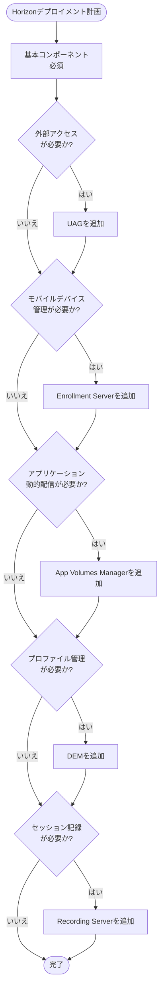
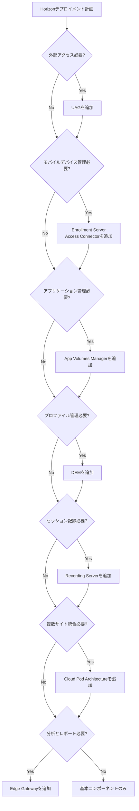

# 1.2 Planning Horizon Deployments

## 概要

Horizon環境の計画は、成功したデプロイメントの基盤です。OCE-Hレベルでは、特定の要件に基づいて必要なコンポーネントを特定し、CCU（Concurrent User）とHA/DR要件に基づいて管理コンポーネントを適切にサイジングする能力が求められます。

## 特定のHorizonデプロイメントに必要なコンポーネントの特定

### コンポーネント選択フローチャート



### 基本コンポーネント

すべてのHorizonデプロイメントに必要なコンポーネント：

1. **Connection Server**
   - ユーザー認証とブローカー機能
   - 管理コンソール
   - 必須コンポーネント

2. **vCenter Server**
   - 仮想マシンのライフサイクル管理
   - 必須コンポーネント

3. **ESXi Hosts**
   - 仮想マシンの実行環境
   - 必須コンポーネント

4. **Horizon Agent**
   - 仮想デスクトップとRDSHホストにインストール
   - 必須コンポーネント

5. **Horizon Client**
   - エンドユーザーが接続するクライアント
   - 必須コンポーネント

### オプションコンポーネント

要件に応じて追加するコンポーネント：

#### 外部アクセスが必要な場合

- **Unified Access Gateway (UAG)**
  - 外部ネットワークからの安全なアクセス
  - DMZに配置
  - 複数インスタンスで高可用性構成

#### モバイルデバイス管理が必要な場合

- **Enrollment Server**
  - モバイルデバイスの登録
  - Workspace ONE UEMとの統合

- **Access Connector**
  - MDM統合と条件付きアクセス

#### アプリケーション管理が必要な場合

- **App Volumes Manager**
  - アプリケーションの動的配信
  - AppStackとWritable Volumeの管理

#### プロファイル管理が必要な場合

- **Dynamic Environment Manager (DEM)**
  - ユーザープロファイル管理
  - 環境設定の適用
  - フォルダリダイレクション

#### セッション記録が必要な場合

- **Recording Server**
  - ユーザーセッションの記録
  - コンプライアンス要件への対応

#### 複数サイト統合が必要な場合

- **Cloud Pod Architecture (CPA)**
  - 複数ポッドの統合管理
  - グローバルエンタイトルメント

#### 分析とレポートが必要な場合

- **Edge Gateway**
  - Omnissa Intelligenceへのデータ送信
  - カスタムレポートの生成

### コンポーネント選択の決定フローチャート



## CCUとHA/DR要件に基づく管理コンポーネントのサイジング

### Connection Serverのサイジング

#### CCUに基づくサイジング

| CCU | Connection Server数 | 推奨構成 |
|-----|-------------------|---------|
| 0-500 | 1-2台 | 小規模環境 |
| 500-2,000 | 2-3台 | 中規模環境 |
| 2,000-5,000 | 3-5台 | 大規模環境 |
| 5,000以上 | 5台以上 | エンタープライズ環境 |

**計算式**:
```
必要なConnection Server数 = (CCU / 2,000) + 1（高可用性用）
```

> [!IMPORTANT]

> 上記は一般的なガイドラインです。実際の要件（アプリケーションの種類、セッションの種類など）に応じて調整が必要です。

#### HA要件に基づくサイジング

**高可用性構成**:
- 最小2台（1台が障害時もサービス継続）
- 推奨3台以上（メンテナンス時もサービス継続）

**DR要件**:
- プライマリサイト: 通常のサイジング
- セカンダリサイト: 最小2台（DR用）

### Unified Access Gateway (UAG)のサイジング

#### CCUに基づくサイジング

| CCU | UAG数 | 推奨構成 |
|-----|-------|---------|
| 0-1,000 | 1-2台 | 小規模環境 |
| 1,000-5,000 | 2-4台 | 中規模環境 |
| 5,000以上 | 4台以上 | エンタープライズ環境 |

**ベストプラクティス**:
- UAGとConnection Serverの比率: 1:1（推奨）
- 各UAGは最大2,000 CCUをサポート

> [!TIP]

> UAGとConnection Serverの1:1比率を維持することで、パフォーマンスと管理性が向上します。

### App Volumes Managerのサイジング

#### CCUとアプリケーション数に基づくサイジング

| CCU | App Volumes Manager数 | 推奨構成 |
|-----|----------------------|---------|
| 0-1,000 | 1台 | 小規模環境 |
| 1,000-5,000 | 1-2台 | 中規模環境 |
| 5,000以上 | 2台以上 | エンタープライズ環境 |

**高可用性構成**:
- 最小2台（HA用）
- 追加Managerのインストールと登録

### DEMのサイジング

#### CCUに基づくサイジング

| CCU | DEM Management Console数 | ファイル共有数 |
|-----|------------------------|---------------|
| 0-1,000 | 1台 | 1-2台 |
| 1,000-5,000 | 1-2台 | 2-3台 |
| 5,000以上 | 2台以上 | 3台以上 |

**高可用性構成**:
- 複数のファイル共有を設定
- Management Consoleの冗長化

### Recording Serverのサイジング

#### 記録セッション数に基づくサイジング

| 同時記録セッション数 | Recording Server数 | ストレージ要件 |
|-------------------|------------------|-------------|
| 0-100 | 1台 | 100GB以上 |
| 100-500 | 1-2台 | 500GB以上 |
| 500以上 | 2台以上 | 1TB以上 |

**ストレージ計算**:
```
必要なストレージ = 同時記録セッション数 × 記録時間 × データレート
```

### データベースのサイジング

#### Connection Server用データベース

| CCU | データベースサイズ | 推奨構成 |
|-----|------------------|---------|
| 0-1,000 | 10GB | 組み込みデータベース |
| 1,000-5,000 | 50GB | SQL Server Standard |
| 5,000以上 | 100GB以上 | SQL Server Enterprise（Always On） |

#### App Volumes用データベース

| CCU | データベースサイズ | 推奨構成 |
|-----|------------------|---------|
| 0-1,000 | 5GB | SQL Server Standard |
| 1,000-5,000 | 20GB | SQL Server Standard |
| 5,000以上 | 50GB以上 | SQL Server Enterprise（Always On） |

### ネットワーク帯域幅のサイジング

#### セッションあたりの帯域幅要件

| 用途 | 帯域幅要件 |
|------|-----------|
| 基本的なオフィス作業 | 100-200 Kbps |
| マルチメディア | 500 Kbps - 1 Mbps |
| 3Dグラフィックス | 2-5 Mbps |
| ビデオ会議 | 1-2 Mbps |

**総帯域幅計算**:
```
必要な帯域幅 = CCU × セッションあたりの帯域幅 × ピーク使用率（通常1.2-1.5）
```

**詳細な計算例**:
```
例: 1,000 CCU、基本的なオフィス作業
セッションあたりの帯域幅: 150 Kbps
ピーク使用率: 1.3
必要な帯域幅 = 1,000 × 150 Kbps × 1.3 = 195 Mbps

WAN環境の場合:
- レイテンシ補正: 1.2
- プロトコルオーバーヘッド: 1.1
実際の帯域幅 = 195 Mbps × 1.2 × 1.1 = 257.4 Mbps
```

#### ネットワーク設計の詳細

**VLAN設計**:

**推奨VLAN構成**:
- **管理VLAN**: Connection Server、UAG、vCenter Server
- **デスクトップVLAN**: 仮想デスクトップVM
- **RDSH VLAN**: RDSHホスト
- **ストレージVLAN**: ストレージ通信（iSCSI、NFS）
- **vMotion VLAN**: vMotion通信

**VLAN設定例**:
```
VLAN 100: Management (10.0.100.0/24)
VLAN 200: Desktop (10.0.200.0/24)
VLAN 300: RDSH (10.0.300.0/24)
VLAN 400: Storage (10.0.400.0/24)
VLAN 500: vMotion (10.0.500.0/24)
```

**ネットワークセグメンテーション**:

**セグメンテーション戦略**:
- **DMZ**: UAG、外部アクセス
- **内部ネットワーク**: Connection Server、vCenter Server
- **デスクトップネットワーク**: 仮想デスクトップ、RDSHホスト
- **管理ネットワーク**: 管理用の専用ネットワーク

**ファイアウォールルール**:

**必要なポートと方向**:
```
Connection Server → vCenter Server: 443 (HTTPS)
Connection Server → Active Directory: 389/636 (LDAP/LDAPS)
Connection Server → Connection Server: 4001 (JMS)
UAG → Connection Server: 443 (HTTPS)
Client → UAG: 443 (HTTPS)
Desktop → Connection Server: 443 (HTTPS)
```

**QoS（Quality of Service）設定**:

**優先度の設定**:
- **最高優先度**: vMotion、ストレージ通信
- **高優先度**: デスクトップセッション（Blast Protocol）
- **中優先度**: 管理通信
- **低優先度**: バックアップ、レプリケーション

**QoS設定例（vSphere）**:
```powershell
# vSphere Distributed SwitchでのQoS設定
# トラフィッククラスの設定
# Class 0: vMotion (最高優先度)
# Class 1: Storage (最高優先度)
# Class 2: Desktop Session (高優先度)
# Class 3: Management (中優先度)
```

### ストレージのサイジング

#### 仮想デスクトップ用ストレージ

| CCU | IOPS要件 | 容量要件 |
|-----|---------|---------|
| 0-500 | 5,000 IOPS | 5TB |
| 500-2,000 | 20,000 IOPS | 20TB |
| 2,000-5,000 | 50,000 IOPS | 50TB |
| 5,000以上 | 100,000 IOPS以上 | 100TB以上 |

**詳細なIOPS計算**:
```
通常時IOPS = CCU × 10 IOPS/VM
Boot Storm時IOPS = CCU × 50 IOPS/VM（同時起動率20%を想定）
Logon Storm時IOPS = CCU × 30 IOPS/VM（同時ログオン率30%を想定）

必要なIOPS = max(通常時IOPS, Boot Storm時IOPS, Logon Storm時IOPS) × 1.2（オーバーヘッド）
```

**Boot StormとLogon Stormを考慮**:
- Boot Storm: 起動時のIOPSが通常の5-10倍
- Logon Storm: ログオン時のIOPSが通常の3-5倍

**ストレージ設計の詳細**:

#### vSphere Virtual SAN (VSAN)

**VSANの利点**:
- ハイパーコンバージドインフラストラクチャ（HCI）
- 自動階層化（All-Flash、Hybrid）
- 高可用性とフォールトトレランス

**VSAN設計の考慮事項**:
- **ディスクグループ**: 最低3ノード、推奨4-6ノード
- **ストレージポリシー**: FTT（Failures to Tolerate）の設定
- **キャッシング**: 読み取りキャッシュと書き込みバッファ

**VSANストレージポリシーの例**:
```
FTT = 1 (1台の障害に耐える)
ストライピング = 2 (2つのディスクに分散)
キャッシュ予約 = 10%
```

#### NFS (Network File System)

**NFSの利点**:
- シンプルな管理
- スケーラビリティ
- 共有ストレージ

**NFS設計の考慮事項**:
- **NFSバージョン**: NFSv3またはNFSv4.1
- **マウントオプション**: `hard`, `intr`, `timeo`, `retrans`
- **ネットワーク**: 専用のストレージネットワーク（10GbE推奨）

**NFSマウントオプションの例**:
```
nfs://storage.contoso.com:/volumes/horizon
オプション: hard,intr,timeo=14,retrans=2,rsize=1048576,wsize=1048576
```

#### iSCSI

**iSCSIの利点**:
- ブロックストレージ
- 標準的なプロトコル
- コスト効率

**iSCSI設計の考慮事項**:
- **マルチパス**: 複数のパスで高可用性
- **チャネルバンディング**: 複数のNICを束ねて帯域幅を増加
- **Jumbo Frame**: 9000バイトのMTU（推奨）

**iSCSIマルチパスの設定**:
```powershell
# iSCSIマルチパスの確認
Get-IscsiTarget | Get-IscsiSession | Format-Table -AutoSize

# マルチパスの設定
Set-MPIOSetting -NewPathVerificationState Enabled
```

#### Fibre Channel (FC)

**FCの利点**:
- 高性能
- 低レイテンシ
- 専用ネットワーク

**FC設計の考慮事項**:
- **HBA**: 複数のHBAでマルチパス
- **SANスイッチ**: 冗長構成
- **ゾーニング**: 適切なゾーニング設定

> [!WARNING]

> Boot StormとLogon Stormを考慮して、ストレージIOPSを適切にサイジングしてください。不十分なIOPSは、VM起動時間とログオン時間の大幅な増加を引き起こします。

## デプロイメント計画のチェックリスト

### 要件収集

- [ ] CCU数の確定
- [ ] ユーザーの地理的分布
- [ ] アプリケーション要件
- [ ] セキュリティ要件
- [ ] コンプライアンス要件
- [ ] 災害復旧要件
- [ ] 予算制約

### コンポーネント選択

- [ ] 必要なコンポーネントの特定
- [ ] 各コンポーネントのサイジング
- [ ] 高可用性要件の確認
- [ ] 災害復旧要件の確認

### ネットワーク設計

- [ ] ネットワーク帯域幅の計算
- [ ] ファイアウォールルールの定義
- [ ] ロードバランサーの設定
- [ ] DNS設定の確認

### ストレージ設計

- [ ] ストレージ容量の計算
- [ ] IOPS要件の計算
- [ ] Boot StormとLogon Stormの考慮
- [ ] ストレージタイプの選択（VSAN、NFS、iSCSI、FC）
- [ ] ストレージポリシーの設定
- [ ] マルチパスの設定
- [ ] キャッシング戦略の決定

### ハイパーバイザー選択の考慮事項

#### vSphere

**利点**:
- Horizonとの統合が最も深い
- 豊富な機能（vMotion、DRS、HA）
- 大規模なサポートコミュニティ

**考慮事項**:
- ライセンスコスト
- 機能要件に応じたエディション選択

**推奨構成**:
- **小規模環境**: vSphere Standard
- **中規模環境**: vSphere Enterprise Plus
- **大規模環境**: vSphere Enterprise Plus with vSAN

#### Hyper-V

**利点**:
- Windows Serverライセンスに含まれる
- コスト効率
- Windows環境との統合

**考慮事項**:
- Horizonとの統合機能が限定的
- 管理ツールの違い

**推奨構成**:
- Windows Server 2019/2022 Datacenter
- Hyper-Vクラスター構成
- CSV（Cluster Shared Volumes）の使用

#### Nutanix

**利点**:
- ハイパーコンバージドインフラストラクチャ
- 統合管理
- スケーラビリティ

**考慮事項**:
- 専用ハードウェア要件
- 初期コスト

**推奨構成**:
- Nutanix AHV（Acropolis Hypervisor）
- Prism管理コンソール
- 統合ストレージ

#### Microsoft Azure

**利点**:
- クラウドスケーラビリティ
- オペレーティング費用モデル
- グローバル展開

**考慮事項**:
- ネットワークレイテンシ
- データ転送コスト
- コンプライアンス要件

**推奨構成**:
- Azure Virtual Desktop（AVD）との統合
- Azure ExpressRoute
- 適切なVMサイズの選択

### 災害復旧計画の詳細

#### RTO（Recovery Time Objective）とRPO（Recovery Point Objective）

**RTOの定義**:
- 目標復旧時間
- 例: 4時間以内にサービスを復旧

**RPOの定義**:
- 目標復旧ポイント
- 例: 1時間以内のデータ損失

**計算例**:
```
RTO = 4時間
RPO = 1時間

必要なバックアップ頻度 = RPO = 1時間ごと
復旧手順の準備時間 = RTO - 復旧作業時間 = 4時間 - 2時間 = 2時間のバッファ
```

#### DR計画の要素

**1. バックアップ戦略**:
- **Connection Server**: 設定のエクスポート、データベースのバックアップ
- **vCenter Server**: 設定のバックアップ、VMのスナップショット
- **App Volumes**: データベースのバックアップ、ストレージのレプリケーション
- **DEM**: ファイル共有のバックアップ

**2. レプリケーション戦略**:
- **vSphere SRM**: Site Recovery Managerを使用した自動復旧
- **ストレージレプリケーション**: ストレージレベルでのレプリケーション
- **アプリケーションレプリケーション**: アプリケーションレベルでのレプリケーション

**3. フェイルオーバー手順**:
- **手動フェイルオーバー**: 管理者が手動で実行
- **自動フェイルオーバー**: 自動的にフェイルオーバーを実行
- **テストフェイルオーバー**: 定期的なテスト実行

**4. 復旧手順**:
- **ステップバイステップの手順**: 詳細な復旧手順のドキュメント化
- **責任者の明確化**: 各手順の責任者を明確化
- **連絡先情報**: 緊急時の連絡先情報

#### DRテスト計画

**テスト頻度**:
- **四半期ごと**: 推奨
- **年次**: 最小

**テスト項目**:
- バックアップの検証
- 復旧手順のテスト
- RTO/RPOの検証
- ドキュメントの更新

**テストチェックリスト**:
- [ ] バックアップの整合性確認
- [ ] 復旧環境の準備
- [ ] 復旧手順の実行
- [ ] サービス復旧の確認
- [ ] パフォーマンステスト
- [ ] ロールバック手順の確認

### セキュリティ設計

- [ ] 認証方法の選択
- [ ] 証明書の計画
- [ ] ネットワークセグメンテーション
- [ ] アクセス制御ポリシー

## 理解度チェックリスト

以下の項目について理解度を確認してください：

### コンポーネントの特定
- [ ] 特定のHorizonデプロイメントに必要なコンポーネントを識別できる
- [ ] 基本コンポーネントとオプションコンポーネントの違いを説明できる
- [ ] ユースケースに基づいてコンポーネントを選択できる

### サイジング
- [ ] CCUに基づいてConnection Serverをサイジングできる
- [ ] CCUに基づいてUAGをサイジングできる
- [ ] CCUに基づいてApp Volumes Managerをサイジングできる
- [ ] CCUに基づいてDEMをサイジングできる
- [ ] HA/DR要件に基づいてコンポーネントをサイジングできる

### ネットワークとストレージ
- [ ] ネットワーク帯域幅の計算方法を理解している
- [ ] ストレージIOPSの計算方法を理解している
- [ ] Boot StormとLogon Stormを考慮したサイジングができる

### 災害復旧
- [ ] RTOとRPOの概念を理解している
- [ ] DR計画の要素を説明できる
- [ ] DRテスト計画を策定できる

## まとめ

適切なHorizonデプロイメント計画は、要件に基づいて必要なコンポーネントを特定し、CCUとHA/DR要件に基づいて各コンポーネントを適切にサイジングすることが重要です。Boot StormやLogon Stormなどの特殊な状況を考慮し、十分なリソースを確保することで、安定したHorizon環境を構築できます。
