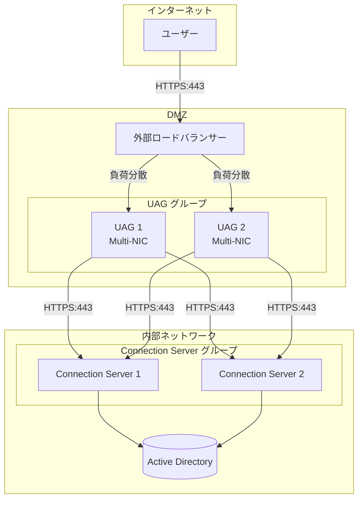

# 1.4 Unified Access Gateways

## 概要

## UAGアーキテクチャ図



Unified Access Gateway (UAG)は、Horizon環境への安全な外部アクセスを提供するエッジサービスです。OCE-Hレベルでは、ユースケースに基づくインストール方法の評価、HA構成の評価、ファイアウォール設定、PowerShellスクリプトによるデプロイ準備が求められます。

## ユースケースに基づくUAGインストール方法の評価

### インストール方法の選択

#### Multi-NIC構成

**ユースケース**:
- DMZ環境での展開
- 内部ネットワークと外部ネットワークの分離が必要
- セキュリティ要件が高い環境

**構成**:
- **NIC 1**: 外部ネットワーク（インターネット接続）
- **NIC 2**: 内部ネットワーク（Connection Server接続）

**利点**:
- ネットワーク分離によるセキュリティ向上
- トラフィックの分離と管理
- ファイアウォールルールの簡素化

**欠点**:
- ネットワーク構成が複雑
- 追加のネットワーク設定が必要

> [!IMPORTANT]
> Multi-NIC構成は、セキュリティ要件が高い環境で推奨されます。内部ネットワークと外部ネットワークを物理的に分離することで、セキュリティが向上します。

#### Single-NIC構成

**ユースケース**:
- シンプルなネットワーク構成
- 小規模環境
- テスト環境

**構成**:
- **NIC 1**: 内部ネットワーク（外部と内部の両方に接続）

**利点**:
- シンプルな構成
- 設定が容易
- リソース要件が低い

**欠点**:
- セキュリティが低い
- ネットワーク分離がない

### PowerShellスクリプト vs UI

#### PowerShellスクリプトによるデプロイ

**ユースケース**:
- 複数のUAGインスタンスの一括デプロイ
- 自動化されたデプロイメント
- 一貫性のある設定

**利点**:
- 一貫性のある設定
- 再現性が高い
- 自動化が可能
- 設定のバージョン管理が容易

**手順**:

1. **設定ファイルの準備**
   ```json
   {
     "connectionServer": "horizon.contoso.com",
     "adminPassword": "SecurePassword123!",
     "network": {
       "external": "10.0.0.100",
       "internal": "10.0.1.100"
     }
   }
   ```

2. **PowerShellスクリプトの実行**
   ```powershell
   # UAG設定スクリプトの例
   .\configure-uag.ps1 -ConfigFile "uag-config.json"
   ```

> [!TIP]
> PowerShellスクリプトによるデプロイは、複数のUAGインスタンスをデプロイする場合や、CI/CDパイプラインに統合する場合に推奨されます。

#### UIによるデプロイ

**ユースケース**:
- 単一のUAGインスタンス
- 手動設定が必要な環境
- 初回デプロイメント

**利点**:
- 視覚的な設定
- 対話的な設定
- エラーの即座の確認

**欠点**:
- 時間がかかる
- 人的エラーの可能性
- 一貫性の確保が困難

### インストール方法の選択ガイド

| 要件 | 推奨方法 |
|------|---------|
| セキュリティ重視 | Multi-NIC + PowerShellスクリプト |
| 迅速なデプロイ | Single-NIC + UI |
| 一貫性重視 | PowerShellスクリプト |
| 複数インスタンス | PowerShellスクリプト |
| 単一インスタンス | UI |

## UAGのHA構成評価

### ロードバランサーを使用したHA構成

#### サードパーティロードバランサー

**対応製品**:
- F5 BIG-IP
- Citrix ADC (NetScaler)
- A10 Networks
- Kemp LoadMaster

**構成例（F5 BIG-IP）**:

```bash
# Virtual Serverの作成
ltm virtual /Common/horizon-uag-vs {
    destination /Common/10.0.0.100:443
    ip-protocol tcp
    mask 255.255.255.255
    pool /Common/horizon-uag-pool
    profiles {
        /Common/tcp { }
        /Common/http { }
        /Common/client-ssl {
            cert-key-chain {
                default {
                    cert /Common/horizon-uag.crt
                    key /Common/horizon-uag.key
                }
            }
        }
    }
    source 0.0.0.0/0
    translate-address enabled
    translate-port enabled
}

# Poolの作成
ltm pool /Common/horizon-uag-pool {
    members {
        /Common/10.0.0.101:443 {
            address 10.0.0.101
        }
        /Common/10.0.0.102:443 {
            address 10.0.0.102
        }
    }
    monitor /Common/https_monitor
    load-balancing-mode round-robin
}
```

**利点**:
- 高度な負荷分散機能
- 詳細な監視とレポート
- 柔軟な設定オプション

**欠点**:
- 追加のライセンスコスト
- 設定が複雑

> [!TIP]
> サードパーティロードバランサーは、高度な負荷分散機能が必要な大規模環境で推奨されます。

#### UAG HA

**概要**:
- UAG独自の高可用性機能
- アクティブ/パッシブ構成
- 自動フェイルオーバー

**構成手順**:

1. **プライマリUAGの設定**
   - 通常のUAGインストールと設定

2. **セカンダリUAGの設定**
   - プライマリUAGの設定をレプリケート
   - HAモードで設定

3. **HA設定の有効化**
   - UAG管理コンソールでHAを有効化
   - プライマリとセカンダリを指定

**利点**:
- 追加のライセンス不要
- シンプルな構成
- 自動フェイルオーバー

**欠点**:
- 機能が限定的
- アクティブ/パッシブのみ

> [!NOTE]
> UAG HAは、シンプルな高可用性要件に適しています。より高度な機能が必要な場合は、サードパーティロードバランサーを検討してください。

### HA構成の選択ガイド

| 要件 | 推奨構成 |
|------|---------|
| シンプルなHA | UAG HA |
| 高度な負荷分散 | サードパーティロードバランサー |
| アクティブ/アクティブ | サードパーティロードバランサー |
| アクティブ/パッシブ | UAG HA |

## UAGセッションプロトコルのファイアウォール設定評価

### 必要なポート

#### 外部ネットワーク（クライアント接続）

| ポート | プロトコル | 用途 | 方向 |
|--------|-----------|------|------|
| 443 | HTTPS | クライアント接続、管理 | 受信 |
| 4172 | TCP/UDP | PCoIPトンネル | 受信 |
| 22443 | TCP | Blast Protocolトンネル | 受信 |

#### 内部ネットワーク（Connection Server接続）

| ポート | プロトコル | 用途 | 方向 |
|--------|-----------|------|------|
| 443 | HTTPS | Connection Server接続 | 送信 |
| 4001 | TCP | JMS（必要に応じて） | 送信 |

### ファイアウォールルールの設定例

#### Windows Firewall

```powershell
# 外部ネットワーク用ルール
New-NetFirewallRule -DisplayName "UAG HTTPS External" `
    -Direction Inbound -LocalPort 443 -Protocol TCP -Action Allow `
    -InterfaceAlias "External"

New-NetFirewallRule -DisplayName "UAG PCoIP External" `
    -Direction Inbound -LocalPort 4172 -Protocol UDP -Action Allow `
    -InterfaceAlias "External"

New-NetFirewallRule -DisplayName "UAG Blast External" `
    -Direction Inbound -LocalPort 22443 -Protocol TCP -Action Allow `
    -InterfaceAlias "External"

# 内部ネットワーク用ルール
New-NetFirewallRule -DisplayName "UAG Connection Server" `
    -Direction Outbound -RemotePort 443 -Protocol TCP -Action Allow `
    -RemoteAddress "10.0.1.10" -InterfaceAlias "Internal"
```

#### ネットワークファイアウォール

**外部ファイアウォールルール**:
- インターネット → UAG: 443, 4172, 22443

**内部ファイアウォールルール**:
- UAG → Connection Server: 443
- UAG → Connection Server: 4001（必要に応じて）

> [!WARNING]
> ファイアウォールルールを設定する際は、最小権限の原則を適用し、必要なポートのみを開放してください。

## UAG設定の作成/エクスポートとPowerShellスクリプトによるデプロイ準備

### 設定のエクスポート

#### UIからのエクスポート

1. **UAG管理コンソールにアクセス**
   - `https://<UAG IP>:9443`にアクセス

2. **設定のエクスポート**
   - Settings → Export Configuration
   - 設定ファイルをダウンロード

#### コマンドラインからのエクスポート

```bash
# SSH経由でUAGに接続
ssh admin@<UAG IP>

# 設定のエクスポート
/opt/vmware/gateway/bin/gateway-cli export-config
```

### PowerShellスクリプトによるデプロイ準備

#### 設定ファイルの作成

```json
{
  "uag": {
    "hostname": "uag.contoso.com",
    "externalIP": "10.0.0.100",
    "internalIP": "10.0.1.100",
    "connectionServer": "horizon.contoso.com",
    "adminPassword": "SecurePassword123!",
    "sslCertificate": {
      "certPath": "C:\\Certificates\\uag.crt",
      "keyPath": "C:\\Certificates\\uag.key"
    }
  }
}
```

#### PowerShellスクリプトの作成

```powershell
# UAG設定スクリプト
param(
    [Parameter(Mandatory=$true)]
    [string]$ConfigFile
)

# 設定ファイルの読み込み
$config = Get-Content $ConfigFile | ConvertFrom-Json

# UAG設定の適用
# 実際の設定コマンドは、UAGのAPIまたはCLIを使用
```

> [!TIP]
> PowerShellスクリプトによるデプロイは、複数のUAGインスタンスを一貫して設定する場合に特に有効です。

## ベストプラクティス

1. **ネットワーク設計**
   - Multi-NIC構成を推奨（セキュリティ向上）
   - 内部ネットワークと外部ネットワークの分離

2. **HA構成**
   - 最小2台のUAGインスタンス
   - ロードバランサーを使用（推奨：1:1比率でConnection Serverと統合）

3. **セキュリティ**
   - 最小権限の原則を適用
   - 必要なポートのみを開放
   - 定期的なセキュリティ更新

4. **デプロイメント**
   - PowerShellスクリプトによる自動化
   - 設定のバージョン管理
   - テスト環境での検証

## UAGクラスターの詳細設定

### クラスター構成の設定

**クラスターの要件**:
- 最小2台のUAGインスタンス
- 同じバージョン
- 同じ設定

**クラスター設定手順**:

1. **プライマリUAGの設定**
   - 通常のUAGインストールと設定
   - クラスターモードを有効化

2. **セカンダリUAGの設定**
   - プライマリUAGと同じ設定でインストール
   - クラスターに参加

3. **クラスター設定の確認**
   - UAG管理コンソールでクラスター状態を確認
   - すべてのメンバーが正常であることを確認

**クラスター設定の詳細**:
```
UAG管理コンソール → Settings → Cluster Configuration
- Cluster Mode: Enabled
- Primary Node: uag-01.contoso.com
- Secondary Nodes: uag-02.contoso.com, uag-03.contoso.com
- Heartbeat Interval: 5秒
- Failover Timeout: 30秒
```

## セッション管理とタイムアウト設定

### セッションタイムアウトの設定

**設定項目**:
- **Idle Timeout**: アイドルセッションのタイムアウト時間（デフォルト: 30分）
- **Session Timeout**: セッション全体のタイムアウト時間（デフォルト: 8時間）
- **Reconnect Timeout**: 再接続のタイムアウト時間（デフォルト: 5分）

**設定手順**:

1. **UAG管理コンソールでの設定**
   ```
   Settings → Session Management
   - Idle Timeout: 30分
   - Session Timeout: 8時間
   - Reconnect Timeout: 5分
   ```

2. **推奨設定値**:
   | 環境 | Idle Timeout | Session Timeout |
   |------|-------------|----------------|
   | 標準環境 | 30分 | 8時間 |
   | セキュリティ重視 | 15分 | 4時間 |
   | 高密度環境 | 20分 | 6時間 |

### セッション管理の最適化

**セッションアフィニティの設定**:
- ロードバランサーでセッションアフィニティを有効化
- 同じクライアントが同じUAGインスタンスに接続

**セッション数の制限**:
- UAGインスタンスあたりの最大セッション数
- 推奨: 2,000セッション/UAG

## 証明書のピニング

### 証明書ピニングの概要

**機能**:
- 特定の証明書のみを信頼
- 中間者攻撃（MITM）の防止
- セキュリティの向上

**設定手順**:

1. **証明書のフィンガープリントの取得**
   ```powershell
   # 証明書のフィンガープリントを取得
   $cert = Get-ChildItem -Path Cert:\LocalMachine\My | Where-Object {$_.Subject -like "*horizon*"}
   $cert.Thumbprint
   ```

2. **UAG管理コンソールでの設定**
   ```
   Settings → Security → Certificate Pinning
   - Enable Certificate Pinning: Enabled
   - Certificate Thumbprint: [証明書のフィンガープリント]
   ```

**証明書ピニングの利点**:
- 中間者攻撃の防止
- 証明書の改ざんの検出
- セキュリティの向上

> [!IMPORTANT]
> 証明書ピニングを有効化する場合、証明書の更新時にフィンガープリントも更新する必要があります。

## リバースプロキシ設定の詳細

### リバースプロキシの設定

**設定項目**:
- **Backend Server**: Connection ServerのFQDNまたはIPアドレス
- **Backend Port**: Connection Serverのポート（デフォルト: 443）
- **SSL Termination**: UAGでSSL終端を行うかどうか

**設定手順**:

1. **UAG管理コンソールでの設定**
   ```
   Settings → Reverse Proxy
   - Backend Server: horizon.contoso.com
   - Backend Port: 443
   - SSL Termination: Enabled
   - SSL Certificate: [UAGの証明書]
   ```

2. **高度な設定**:
   - **Connection Pooling**: バックエンド接続のプールサイズ
   - **Timeout Settings**: 接続タイムアウトと読み取りタイムアウト
   - **Health Check**: バックエンドサーバーのヘルスチェック

**リバースプロキシの最適化**:

**接続プールの設定**:
```
Connection Pool Size: 100
Connection Timeout: 30秒
Read Timeout: 60秒
```

**ヘルスチェックの設定**:
```
Health Check URL: /admin
Health Check Interval: 30秒
Health Check Timeout: 10秒
Failure Threshold: 3回
```

## パフォーマンスモニタリングとチューニング

### パフォーマンスメトリックの監視

**監視すべきメトリック**:
- **CPU使用率**: 目標80%以下
- **メモリ使用率**: 目標90%以下
- **ネットワーク帯域幅**: 使用状況の監視
- **セッション数**: アクティブセッション数の監視
- **応答時間**: クライアントへの応答時間

**UAG管理コンソールでの監視**:
```
Monitoring → Performance Metrics
- CPU Usage
- Memory Usage
- Network Throughput
- Active Sessions
- Response Time
```

### パフォーマンスチューニング

**JVM設定の最適化**:
- UAGはJavaベースのアプリケーション
- JVMヒープサイズの調整

**設定ファイルの場所**:
- `/opt/vmware/gateway/conf/gateway.properties`

**推奨設定**:
```properties
# JVMヒープサイズ
java.heap.size=2048m

# ガベージコレクション設定
java.gc.type=G1GC
java.gc.max.pause=200ms
```

**ネットワークチューニング**:
- TCPバッファサイズの調整
- 接続数の最適化

**Linuxカーネルパラメータの調整**:
```bash
# TCPバッファサイズの調整
echo 'net.core.rmem_max = 16777216' >> /etc/sysctl.conf
echo 'net.core.wmem_max = 16777216' >> /etc/sysctl.conf
echo 'net.ipv4.tcp_rmem = 4096 87380 16777216' >> /etc/sysctl.conf
echo 'net.ipv4.tcp_wmem = 4096 65536 16777216' >> /etc/sysctl.conf
sysctl -p
```

**ログファイルの監視**:
- UAGログ: `/opt/vmware/gateway/logs/`
- アクセスログ: `/opt/vmware/gateway/logs/access.log`
- エラーログ: `/opt/vmware/gateway/logs/error.log`

> [!CAUTION]
> UAGの設定変更は、本番環境で行う前に、テスト環境で十分に検証してください。特に、ファイアウォールルールの変更は、接続に影響を与える可能性があります。

## 理解度チェックリスト

以下の項目について理解度を確認してください：

### UAGデプロイ方法
- [ ] Multi-NIC構成とSingle-NIC構成の違いを説明できる
- [ ] PowerShellスクリプト vs UIによるデプロイの違いを理解している
- [ ] ユースケースに基づいて適切なデプロイ方法を選択できる

### HA構成
- [ ] サードパーティロードバランサーを使用したHA構成を説明できる
- [ ] UAG HA機能を使用したHA構成を理解している
- [ ] HA構成の選択基準を説明できる

### ファイアウォール設定
- [ ] UAGセッションプロトコルのファイアウォール設定を理解している
- [ ] 必要なポートを説明できる
- [ ] ファイアウォールルールの設定方法を説明できる

### 設定のエクスポートとデプロイ
- [ ] UAG設定のエクスポート方法を理解している
- [ ] PowerShellスクリプトによるデプロイ準備を説明できる

## まとめ

UAGの適切なデプロイと設定は、Horizon環境への安全な外部アクセスを提供するために重要です。ユースケースに基づいて適切なインストール方法を選択し、HA構成を評価し、ファイアウォール設定を適切に管理し、セッション管理、証明書ピニング、リバースプロキシ設定、パフォーマンスモニタリングとチューニングを適切に設定することで、セキュアで可用性の高いHorizon環境を構築できます。
