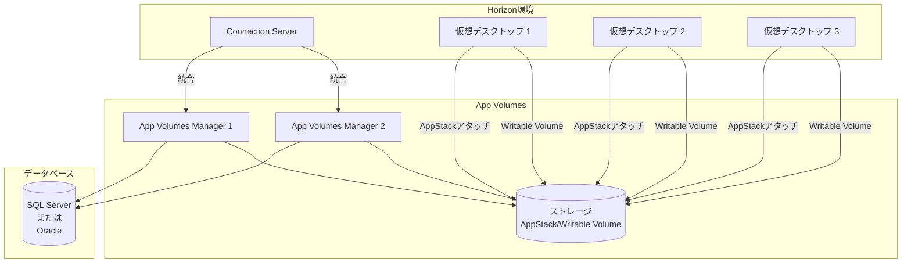

# 1.8 App Volumes Integration

## 概要

## App Volumesアーキテクチャ図



App Volumesの統合は、アプリケーションの動的配信に重要です。OCE-Hレベルでは、Managerのインストール、追加Managerの登録、SQL接続、Active Directory設定、ストレージ設定、レプリケーション設定が求められます。

## App Volumes Managerのインストール

### システム要件

**要件**:
- Windows Server 2016以降
- Active Directoryドメイン参加
- SQL Server 2012以降またはOracle 11g以降
- ポート443（HTTPS）の開放

### インストール手順

1. **インストーラーの実行**
   - `VMware-App-Volumes-Manager-x.x.x-xxxxx.exe`を実行

2. **インストールウィザードの進行**
   - ライセンス契約への同意
   - インストール先の選択
   - データベースの設定

3. **初期設定**
   - Service Accountの設定
   - データベース接続の設定
   - Active Directory統合の設定

## 追加App Volumes Managerのインストールと登録

### 追加Managerのインストール

**手順**:

1. **追加Managerでのインストール**
   - 同じインストーラーを使用
   - 既存のManagerを指定

2. **登録**
   - 既存のManagerに登録
   - 設定の同期

:::important
複数のApp Volumes Managerを登録することで、高可用性を実現できます。
:::

## SQL接続の設定

### SQL Server接続

**設定手順**:

1. **データベースの作成**
   ```sql
   CREATE DATABASE appvolumes
   ON (NAME = 'appvolumes', FILENAME = 'C:\Data\appvolumes.mdf')
   LOG ON (NAME = 'appvolumes_log', FILENAME = 'C:\Data\appvolumes_log.ldf');
   GO
   ```

2. **データベースユーザーの作成**
   ```sql
   CREATE LOGIN appvolumes_user WITH PASSWORD = 'StrongPassword123!';
   USE appvolumes;
   CREATE USER appvolumes_user FOR LOGIN appvolumes_user;
   ALTER ROLE db_owner ADD MEMBER appvolumes_user;
   GO
   ```

3. **App Volumes Managerでの設定**
   - Database Type: SQL Server
   - Server: SQL ServerのFQDNまたはIPアドレス
   - Database: appvolumes
   - Username: appvolumes_user
   - Password: 設定したパスワード

### Oracle接続

**設定手順**:
1. データベースの作成
2. ユーザーの作成
3. App Volumes Managerでの設定

## 認証のためのActive Directory設定

### Service Accountの設定

**要件**:
- ドメインユーザーアカウント
- パスワードの永続化
- 適切な権限

**設定手順**:
1. Service Accountの作成
2. App Volumes Managerでの設定
3. 権限の確認

## ストレージとストレージグループの設定

### ストレージの設定

**対応ストレージ**:
- NFS
- SMB/CIFS
- vSphereデータストア

**設定手順**:
1. App Volumes Manager → Storage
2. New Storageをクリック
3. ストレージタイプを選択
4. 接続情報を入力

### ストレージグループの詳細設定

**機能**:
- 複数のストレージをグループ化
- 負荷分散
- 高可用性

**設定手順**:
1. App Volumes Manager → Storage Groups
2. New Storage Groupをクリック
3. ストレージを追加

**ストレージグループの詳細設定**:

#### 負荷分散の設定

**負荷分散方法**:
- **Round Robin**: 順番にストレージを選択
- **Least Used**: 使用量が少ないストレージを選択
- **Random**: ランダムにストレージを選択

**設定例**:
```
Storage Group: Production-Storage-Group
Members:
  - storage1.contoso.com
  - storage2.contoso.com
  - storage3.contoso.com
Load Balancing: Least Used
```

#### 高可用性の設定

**フェイルオーバーの設定**:
- ストレージ障害時の自動フェイルオーバー
- フェイルオーバー時間の設定

**設定例**:
```
Failover Timeout: 30秒
Retry Interval: 5分
Max Retries: 3回
```

## App VolumesとHorizon Connection Serverの統合

### 統合手順

1. **Horizon Consoleでの設定**
   - View Configuration → App Volumes
   - App Volumes ManagerのFQDNまたはIPアドレスを入力
   - 認証情報を入力

2. **接続テスト**
   - Test Connectionをクリック
   - 接続が成功することを確認

:::tip
App VolumesとHorizon Connection Serverの統合により、アプリケーションの動的配信が可能になります。
:::

## レプリケーション用ストレージ要件の定義

### ストレージ要件

**考慮事項**:
- レプリケーション先のストレージ容量
- ネットワーク帯域幅
- レプリケーション時間

**計算式**:
```
必要なストレージ = AppStack数 × 平均サイズ × レプリケーション数
```

## パートナーとのレプリケーション設定

### レプリケーションの設定

**手順**:

1. **レプリケーション先の設定**
   - App Volumes Manager → Replication
   - New Replication Partnerをクリック
   - パートナーの情報を入力

2. **レプリケーションスケジュール**
   - 即座にレプリケーション
   - スケジュールされたレプリケーション

**レプリケーションの詳細設定**:

#### レプリケーションスケジュールの設定

**スケジュールオプション**:
- **即座にレプリケーション**: 変更があったら即座にレプリケート
- **スケジュールされたレプリケーション**: 指定した時間にレプリケート
- **手動レプリケーション**: 管理者が手動で実行

**スケジュール設定例**:
```
レプリケーション時間: 毎日 02:00
レプリケーション間隔: 1時間ごと
レプリケーション遅延: 30分
```

#### レプリケーションのトラブルシューティング

**一般的な問題**:
- レプリケーションの失敗
- レプリケーションの遅延
- データの不整合

**トラブルシューティング手順**:
1. ネットワーク接続の確認
2. ストレージ容量の確認
3. ログファイルの確認
4. 手動レプリケーションの実行

**ログファイルの確認**:
```
App Volumes Managerログ:
C:\ProgramData\VMware\App Volumes Manager\logs\
```

:::warning
レプリケーションは、ネットワーク帯域幅を消費します。レプリケーションスケジュールを適切に設定してください。
:::

## ストレージアクセスモードの設定

### アクセスモードの種類

#### Direct Access

**概要**:
- 直接ストレージにアクセス
- 高速なアクセス

**要件**:
- ストレージへの直接接続
- 適切なネットワーク帯域幅

#### Managed Mode

**概要**:
- App Volumes Manager経由でアクセス
- 集中管理

**要件**:
- App Volumes Managerへの接続

### 設定方法

1. App Volumes Manager → Storage
2. ストレージを選択
3. Access Modeを選択

## AppStackとWritable Volumeの詳細な管理

### AppStackの管理

**AppStackのライフサイクル**:
- 作成: パッケージングVMでアプリケーションをインストール
- 配布: ユーザーまたはマシンに割り当て
- 更新: 新しいバージョンで更新
- 削除: 不要になったAppStackを削除

**AppStackのバージョン管理**:
- バージョン番号の付与
- バージョン履歴の管理
- ロールバック機能

**AppStackの配布戦略**:
- **ユーザー割り当て**: 特定のユーザーに割り当て
- **マシン割り当て**: 特定のマシンに割り当て
- **グループ割り当て**: グループに割り当て

### Writable Volumeの管理

**Writable Volumeの作成**:
- ユーザーまたはマシンごとに作成
- サイズの設定
- ストレージの選択

**Writable Volumeの最適化**:
- サイズの適切な設定
- 定期的なクリーンアップ
- 不要なデータの削除

**Writable Volumeのバックアップ**:
- 定期的なバックアップ
- バックアップの検証
- リストア手順の準備

## アプリケーションライフサイクル管理

### アプリケーションの更新

**更新手順**:

1. **新しいバージョンのパッケージング**
   - パッケージングVMで新しいバージョンをインストール
   - 新しいAppStackを作成

2. **テスト環境での検証**
   - テスト環境で新しいAppStackをテスト
   - 動作確認

3. **本番環境への展開**
   - 段階的な展開
   - ユーザーへの通知

4. **旧バージョンの削除**
   - 新しいバージョンが安定したら旧バージョンを削除

### アプリケーションの削除

**削除手順**:

1. **割り当ての解除**
   - ユーザーまたはマシンからの割り当てを解除

2. **削除の確認**
   - 削除の影響を確認
   - バックアップの確認

3. **AppStackの削除**
   - App Volumes ManagerからAppStackを削除
   - ストレージから削除

## ベストプラクティス

1. **高可用性**
   - 複数のApp Volumes Managerを配置
   - 高可用性データベースの使用
   - ストレージグループの使用

2. **ストレージ**
   - 適切なストレージ容量の確保
   - レプリケーションの計画
   - ストレージグループの最適化

3. **セキュリティ**
   - Service Accountの適切な管理
   - ストレージアクセス権限の設定
   - アプリケーションの検証

4. **ライフサイクル管理**
   - バージョン管理の実施
   - 定期的な更新
   - 不要なAppStackの削除

## 理解度チェックリスト

以下の項目について理解度を確認してください：

### App Volumes Manager
- [ ] App Volumes Managerのインストール手順を理解している
- [ ] 追加App Volumes Managerのインストールと登録方法を説明できる

### データベースと認証
- [ ] SQL接続の設定方法を理解している
- [ ] Active Directory認証設定を説明できる

### ストレージ
- [ ] StorageとStorage Groupの設定方法を理解している
- [ ] Storage Access Modeの設定を説明できる
- [ ] レプリケーション用ストレージ要件の定義方法を理解している

### 統合とレプリケーション
- [ ] Horizon Connection Serverへの統合方法を説明できる
- [ ] パートナーとのレプリケーション設定方法を理解している

## まとめ

App Volumesの適切な統合は、アプリケーションの動的配信に重要です。Managerのインストール、データベース設定、ストレージ設定、レプリケーション設定、AppStackとWritable Volumeの詳細な管理、アプリケーションライフサイクル管理の適切な実施により、効率的で可用性の高いApp Volumes環境を構築できます。
