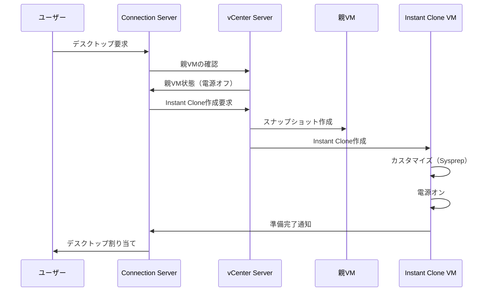

# 2.2 Desktop Pools

## 概要

## デスクトッププールタイプの比較

| プールタイプ | 割り当て方法 | クローンタイプ | 用途 |
|------------|------------|--------------|------|
| 永続デスクトップ | 専用割り当て | Full Clone | 個人データの保持が必要 |
| 非永続デスクトップ | フローティング割り当て | Instant Clone | タスクワーカー、コスト効率重視 |

## Instant Cloneプロビジョニングフロー



デスクトッププールの管理は、Horizon環境の運用に重要です。OCE-Hレベルでは、高度な設定、プロビジョニング最適化、リソース管理、容量計画が求められます。

## デスクトッププールの種類と選択

### 永続デスクトッププール

**特徴**:
- 専用割り当て（Dedicated Assignment）
- データと設定が永続的に保持
- ユーザーがカスタマイズ可能

**用途**:
- 開発者や高度なユーザー
- カスタマイズが必要な環境
- データ保持が重要な環境

**推奨クローン方式**:
- フルクローン（Full Clone）

### 非永続デスクトッププール

**特徴**:
- フローティング割り当て（Floating Assignment）
- セッション終了後に変更が破棄
- 常にクリーンな状態

**用途**:
- タスクワーカー
- 標準化された環境
- コスト効率が重要な環境

**推奨クローン方式**:
- インスタントクローン（Instant Clone）

## 高度なプロビジョニング設定

### Instant Clone設定

#### 親VMの設定

**要件**:
- Horizon Agentがインストールされている
- スナップショットが作成されている
- 親VMが電源オフ状態

**親VMの準備**:
1. ゴールデンイメージでVMを作成
2. Horizon Agentをインストール
3. 最適化を適用
4. スナップショットを作成

#### 差分ディスクの設定

**設定項目**:
- 差分ディスクの場所
- 差分ディスクのサイズ
- ストレージポリシー

**最適化**:
- 差分ディスクを高速ストレージに配置
- 適切なサイズを設定（過剰なサイズは避ける）

#### プロビジョニング時間の最適化

**最適化方法**:
1. 親VMの最適化
2. ストレージIOPSの確保
3. ネットワーク帯域幅の確保
4. vCenter Serverのパフォーマンス最適化

> [!IMPORTANT]

> Instant Cloneのプロビジョニング時間は、親VMの状態とストレージパフォーマンスに大きく依存します。

### フルクローン設定

**設定項目**:
- クローン作成のタイミング
- ストレージの選択
- ネットワークの設定

**最適化**:
- ストレージIOPSの確保
- ネットワーク帯域幅の確保
- バッチ処理の使用

## リソース管理

### CPU割り当て

**考慮事項**:
- アプリケーション要件
- ユーザーの使用パターン
- VM密度

**推奨設定**:
| 用途 | CPUコア数 |
|------|----------|
| 基本的なオフィス作業 | 2 vCPU |
| 開発環境 | 4 vCPU |
| 高負荷アプリケーション | 4-8 vCPU |

### メモリ割り当て

**考慮事項**:
- OS要件（Windows 10/11: 最低4GB）
- アプリケーション要件
- VM密度

**推奨設定**:
| 用途 | メモリ容量 |
|------|----------|
| 基本的なオフィス作業 | 4GB |
| 標準的な作業 | 8GB |
| 高負荷アプリケーション | 16GB以上 |

### ストレージ割り当て

**考慮事項**:
- OS容量
- アプリケーション容量
- ユーザーデータ容量（永続デスクトップ）

**推奨設定**:
| 用途 | ディスクサイズ |
|------|--------------|
| 非永続デスクトップ | 60GB |
| 永続デスクトップ | 100GB以上 |

> [!TIP]

> リソース割り当ては、パフォーマンスと密度のバランスを考慮して設定してください。

## プール更新の詳細手順

### 親VMの更新

**更新手順**:

1. **新しいスナップショットの作成**
   - 更新されたゴールデンイメージでスナップショットを作成
   - スナップショット名にバージョン番号を含める

2. **Horizon Consoleでの更新**
   - Inventory → Desktop Pools
   - プールを選択 → Edit
   - vCenter Settings → Parent VM
   - 新しいスナップショットを選択

3. **プールの再プロビジョニング**
   - 既存のVMを削除（オプション）
   - 新しいVMをプロビジョニング

**段階的な更新**:

1. **メンテナンスモードの有効化**
   - プールをメンテナンスモードに設定
   - 新しい接続を防止

2. **既存セッションの終了待機**
   - ユーザーに通知
   - セッションの終了を待機

3. **VMの更新**
   - 既存のVMを削除
   - 新しいVMをプロビジョニング

4. **メンテナンスモードの解除**
   - メンテナンスモードを解除
   - 新しい接続を許可

### スナップショットの更新

**更新手順**:

1. **親VMの更新**
   - ゴールデンイメージで更新を適用
   - 新しいスナップショットを作成

2. **プール設定の更新**
   - Horizon Console → Desktop Pools
   - プールを選択 → Edit
   - 新しいスナップショットを選択

3. **検証**
   - 新しいVMの動作確認
   - パフォーマンステスト

## プールのスケーリング戦略

### 自動スケーリングの詳細設定

**設定項目**:
- 最小VM数
- 最大VM数
- プロビジョニング閾値
- プロビジョニング遅延

**詳細な設定例**:
```
最小VM数: 10
最大VM数: 500
プロビジョニング閾値: 80%（利用可能VMが20%以下になったらプロビジョニング）
プロビジョニング遅延: 5分（連続して閾値を超えた場合のみプロビジョニング）
プロビジョニングバッチサイズ: 10 VM（一度にプロビジョニングするVM数）
```

**スケーリングアルゴリズム**:
- **予測的スケーリング**: 使用パターンに基づいて事前にプロビジョニング
- **リアクティブスケーリング**: 需要に応じてリアルタイムでプロビジョニング

## プールのメンテナンスモード

### メンテナンスモードの設定

**設定手順**:

1. **Horizon Consoleでの設定**
   - Inventory → Desktop Pools
   - プールを選択 → Edit
   - Settings → Maintenance Mode
   - Maintenance Modeを有効化

2. **メンテナンスモードの動作**:
   - 新しい接続を防止
   - 既存のセッションは継続
   - 管理者は接続可能（オプション）

**メンテナンスモードの使用例**:
- プールの更新時
- トラブルシューティング時
- パフォーマンステスト時

## プールの削除とクリーンアップ手順

### プールの削除

**削除前の確認**:
- アクティブなセッションがないことを確認
- エンタイトルメントの削除
- バックアップの取得

**削除手順**:

1. **エンタイトルメントの削除**
   - プールからすべてのエンタイトルメントを削除

2. **VMの削除**
   - プール内のすべてのVMを削除
   - または、VMを保持（オプション）

3. **プールの削除**
   - Horizon Console → Desktop Pools
   - プールを選択 → Delete
   - 確認

**クリーンアップ手順**:

1. **vCenter Serverでのクリーンアップ**
   - 削除されたVMの完全な削除
   - スナップショットの削除
   - ストレージの解放

2. **Active Directoryでのクリーンアップ**
   - コンピューターアカウントの削除
   - OUからの削除

## 容量計画とスケーリング

### 容量計算

**計算式**:
```
必要なVM数 = (CCU数) / (同時使用率)
同時使用率 = 同時に使用するユーザー数 / 総ユーザー数
```

**例**:
- 総ユーザー数: 1000人
- 同時使用率: 50%
- 必要なVM数: 1000 × 0.5 = 500 VM

### 自動スケーリング

**設定項目**:
- 最小VM数
- 最大VM数
- プロビジョニング閾値

**設定例**:
- 最小VM数: 10
- 最大VM数: 500
- プロビジョニング閾値: 80%（利用可能VMが20%以下になったらプロビジョニング）

## モニタリングと最適化

### パフォーマンス監視

**監視項目**:
- VM起動時間
- ログオン時間
- リソース使用率
- セッション数

**監視ツール**:
- Horizon Console
- vSphere Client
- パフォーマンスモニター

### 使用状況の追跡

**追跡項目**:
- アクティブセッション数
- ピーク使用時間
- リソース使用率
- ユーザー満足度

## ベストプラクティス

1. **容量計画**
   - リソース要件の評価
   - 成長予測の考慮
   - スケーリング計画

2. **プロビジョニング最適化**
   - 親VMの最適化
   - ストレージパフォーマンスの確保
   - ネットワーク帯域幅の確保

3. **モニタリング**
   - 定期的なパフォーマンス監視
   - 使用状況の追跡
   - トレンド分析

> [!CAUTION]

> デスクトッププールの設定変更は、すべてのVMに影響を与える可能性があります。本番環境で変更する前に、テスト環境で十分に検証してください。

## トラブルシューティング

### 一般的な問題

**VMがプロビジョニングされない**:
- ストレージ容量を確認
- リソースプールの容量を確認
- vCenter Serverの接続を確認

**プロビジョニング時間が長い**:
- ストレージIOPSを確認
- ネットワーク帯域幅を確認
- 親VMの状態を確認

## 理解度チェックリスト

以下の項目について理解度を確認してください：

### デスクトッププールの種類
- [ ] 永続デスクトッププールと非永続デスクトッププールの違いを説明できる
- [ ] 専用割り当てとフローティング割り当ての違いを理解している
- [ ] 用途に応じたプールタイプの選択ができる

### プロビジョニング設定
- [ ] Instant Clone設定の最適化方法を理解している
- [ ] プロビジョニング時間の最適化方法を説明できる

### リソース管理
- [ ] リソース割り当ての設定方法を理解している
- [ ] 容量計画の方法を説明できる

## まとめ

デスクトッププールの適切な管理は、Horizon環境の効率的な運用に重要です。高度な設定、プロビジョニング最適化、リソース管理、容量計画により、効率的でスケーラブルなデスクトッププール環境を構築できます。
