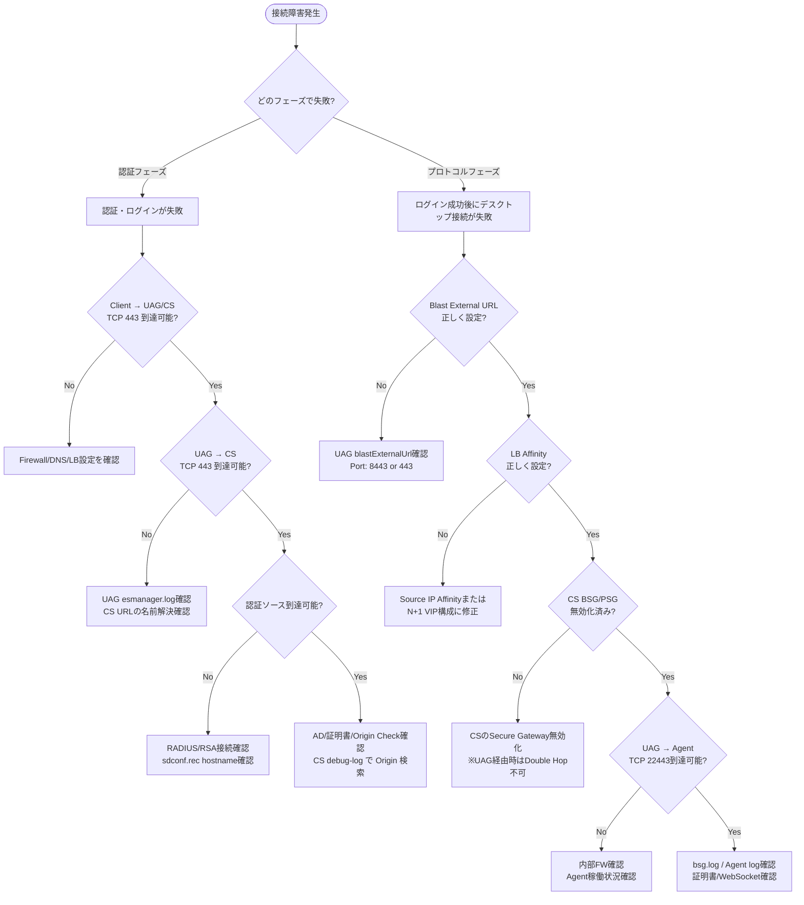

# 4.1 Complex VDI Issues のトラブルシューティングと解決

## 試験ガイド対応 (Section 4.4.1)

- Troubleshoot and resolve complex VDI issues, such as connection failures, resource bottlenecks, storage I/O issues, and GPU resource allocation problems.
- Understand Boot storms and Logon storms.
- Identify CPU and memory in-guest bottlenecks.
- Identify when too small a GPU profile has been used.
- Troubleshoot Global Entitlements (dependency of initial configuration like protocol settings etc.)
- Identify and troubleshoot graphic driver issues at VM Level (GPU, Non-GPU)
- Enable instant clone debug mode.

---

## 1. 接続フローと障害パターン（Connection Flow & Failure Patterns）

### 1.1 Horizon接続の2フェーズモデル

Horizon Clientがリソースに接続する際、2つのフェーズで通信が行われる。各フェーズで異なるプロトコルが使用され、障害切り分けの基点となる。

| フェーズ | プロトコル | 役割 |
|----------|-----------|------|
| Primary（認証フェーズ） | XML-API over HTTPS (TCP 443) | 認証・認可・セッション管理 |
| Secondary（プロトコルフェーズ） | Blast Extreme / PCoIP / RDP | 表示プロトコルセッション |

### 1.2 内部接続の通信フロー（Internal Connection）

内部接続では、ClientがConnection Serverに直接認証し、セカンダリプロトコルもClientからAgentに直接接続する。LBはPrimary（XML-API）のみで使用される。

```
Client → [TCP 443] → (LB) → Connection Server   ... Primary (認証)
Client → [TCP/UDP 22443] → Horizon Agent          ... Secondary (Blast)
```

| Step | 通信区間 | ポート | 目的 |
|------|---------|--------|------|
| 1 | Client → CS | TCP 443 | 認証・認可・セッション管理 |
| 2 | Client → Agent | Blast: TCP/UDP 22443, PCoIP: TCP/UDP 4172 | プロトコル直接接続 |

> **注意**: 内部接続ではSecondary プロトコルがClientからAgentへ直接接続されるため、LBはSecondaryトラフィックのルーティングに関与しない。CSのBSG/PSG/Tunnelが有効化されている場合のみ、プロトコルセッションがCS経由となる（Tunneled Connection）。

### 1.3 外部接続の通信フロー（External Connection）

```
Client → [TCP 443] → LB → [TCP 443] → UAG → [TCP 443] → Connection Server
                                                              ↓ (認証・認可完了)
Client → [TCP 8443/443] → LB → [TCP 8443/443] → UAG → [TCP 22443] → Horizon Agent
```

**通信フローの6ステップ**:

| Step | 通信区間 | ポート | 目的 |
|------|---------|--------|------|
| 1 | Client → LB | TCP 443 | LBへの認証トラフィック |
| 2 | LB → UAG | TCP 443 | UAGへの認証トラフィック転送 |
| 3 | UAG → 3rd Party IdP | RADIUS: UDP 1812 / RSA: UDP 5500 | 多要素認証（任意） |
| 4 | UAG → Connection Server | TCP 443 | CS URLに基づく認証転送 |
| 5 | Client → (LB) → UAG | Blast: TCP 8443/443, PCoIP: TCP/UDP 4172 | セカンダリプロトコルセッション |
| 6 | UAG → Horizon Agent | Blast: TCP/UDP 22443, PCoIP: TCP/UDP 4172 | Agentへのプロトコル転送 |

### 1.4 Agent → Connection Server通信

Horizon AgentはConnection Serverに対してJMS（Java Message Service）で状態を報告する。この通信は接続フローとは独立して常時行われる。

| ポート | 用途 |
|--------|------|
| TCP 4001 | JMS通信 |
| TCP 4002 | JMS SSL通信（Enhanced Securityモード時、デフォルトで使用） |
| TCP 32111 | Framework Channel（vdmadmin操作、DCT収集等） |

### 1.5 接続障害の切り分けフローチャート



### 1.6 各段階の主要な失敗パターン

#### Client → UAG

| 障害パターン | 症状 | 確認方法 |
|-------------|------|---------|
| Firewallブロック | 接続タイムアウト | `Test-NetConnection uag-host -Port 443` |
| LB Affinity不正 | 認証後にBlast接続失敗 | UAG `bsg.log` で `Removing idle route` を確認 |
| WebSocket未有効 | Blast Extreme接続失敗 | LB設定でWebSocket有効化を確認 |
| blastExternalUrl不正 | Blast接続がUAGに到達しない | UAG Admin Console → Edge Service Settings |
| 証明書不一致 | TLS handshake失敗 | `curl -k -v https://127.0.0.1 >/dev/null`（UAG上） |

**bsg.logでのLB Affinity問題の典型的なログ**:

```
[absg-master] – Removing idle route 44271692-*** to target 192.168.2.151|22443,
idled for 60.00 seconds, registered for 60.01 seconds
```

#### UAG → Connection Server

| 障害パターン | 症状 | 確認方法 |
|-------------|------|---------|
| DNS解決失敗 | 認証フェーズ失敗 | UAGで `nslookup cs-hostname` |
| TCP 443ブロック | UAG → CS間タイムアウト | UAGで `curl -v -k https://cs-hostname:443/` |
| .localドメイン問題 | mDNS予約で解決不可（UAG 3.7+） | CNAME別名/hosts entry/IP直指定で対処 |

**esmanager.logの典型的なエラー**:

```
[nioEventLoopGroup-7-1]ERROR view.ViewEdgeService[onFailure: 165][]:
Failed to resolve hostname address in proxyDestinationUrl: cs-hostname.local
```

#### UAG → Horizon Agent

| 障害パターン | 症状 | 確認方法 |
|-------------|------|---------|
| CS BSG有効（Double Hop） | Blast接続失敗 | CS管理画面 → Secure Gateway設定を無効化 |
| FW TCP 22443ブロック | プロトコル接続タイムアウト | bsg.logでの接続失敗ログ |
| Agent未稼働 | デスクトップ未応答 | `curl -v telnet://desktop-ip:32111`（Framework Channel） |

> **重要**: Blast Secure Gatewayは「UAGとConnection Serverの両方で有効化」すると Double Hop となり接続失敗する。外部接続ではCSのBSG/PSG/HTTPS Secure Tunnelは必ず無効化すること。唯一の例外は、CSのBSGを「**Use Blast Secure Gateway for only Horizon Web Client connections to machine**」で有効化する設定。この場合、内部HTML AccessのみCSのBSGを経由し、外部UAG経由の接続はDouble Hopにならない。

### 1.7 Horizon Web Client（HTML Access）接続の特殊性

Horizon Web Client（ブラウザ経由のHTML Access）は、ネイティブHorizon Clientとは異なる考慮事項がある。

**内部HTML Access接続でのBSG使用**:

CSのBSG設定に「**Use Blast Secure Gateway for only Horizon Web Client connections to machine**」オプションがある。この設定を有効化すると：

- 内部のWeb ClientユーザーはCSのBSGを経由してBlast接続する（CSの証明書が提示される）
- 内部のネイティブClientはAgentに直接Blast接続する
- 外部ユーザー（UAG経由）はUAGのBSGを使用し、CSのBSGは経由しない（Double Hopにならない）

**Origin Check失敗**:

Web Client経由でLBやUAG経由で接続する場合、CS上のOriginチェックが失敗することがある。

```
# CS debug logでOriginチェック失敗を確認
# debug-*.log で "Origin" を検索
```

解決策: Horizon Consoleの Global Settings → Security Settings で `checkOrigin` を適切に設定するか、許可するOriginを追加する。

### 1.8 接続テストコマンド集

```powershell
# Client → UAG (Blast / PCoIP)
Test-NetConnection uag-hostname -Port 443
Test-NetConnection uag-hostname -Port 8443
Test-NetConnection uag-hostname -Port 4172

# curl trace（TLSハンドシェイク含む詳細トレース）
curl --trace-ascii trace_output.txt https://uag-hostname.domain.com

# UAG上での診断（SSH接続後）
curl -v -k https://cs-hostname:443/
curl -k -v https://127.0.0.1 >/dev/null          # Edge Service証明書確認
curl -k -v https://127.0.0.1:9443 >/dev/null      # Admin UI証明書確認
nslookup cs-hostname
systemd-resolve --status

# UAG tcpdumpインストールと使用
advancedDebugPackages install
tcpdump -i any -n -v port 443
tcpdump -i any -n -v port 8443
tcpdump -i eth0 -n -v udp port 8443
tcpdump -i any -n -v port 4172           # PCoIP
tcpdump -i any -n -v udp port 53         # DNS監視

# Agent到達確認（Framework Channel / MMR/CDR）
curl -v telnet://desktop-ip:32111
curl -v telnet://desktop-ip:9427
```

---

## 2. Boot StormとLogon Stormの理解（Boot Storms and Logon Storms）

### 2.1 定義と影響

| 種類 | 定義 | 主な影響 |
|------|------|---------|
| Boot Storm | 多数のVMが短時間に同時起動する現象。Instant Clone poolのプロビジョニングや電源操作のスケジュール実行時に発生 | ストレージIOPS急増、CPU/Memory負荷、ネットワーク帯域消費 |
| Logon Storm | 業務開始時間帯に多数のユーザーが同時ログオンする現象 | AD認証負荷、プロファイル読み込み負荷、GPO処理のCPUスパイク |

### 2.2 Boot Stormの原因と緩和策

**発生シナリオ**:
- 業務開始前の一斉VM起動（Scheduled Power On）
- Instant Clone poolの大規模プロビジョニング
- メンテナンス後の全VM再起動
- Image Push / Recompose操作

**緩和策**:

| 対策 | 説明 | 設定場所 |
|------|------|---------|
| Stagger Provisioning | 同時プロビジョニング数を制限してI/Oスパイクを平準化 | Horizon Console → vCenter Settings → `Max Concurrent Provisioning Operations`（default: 20） |
| Concurrent Power Operations Rate | 同時電源操作数を制限 | Horizon Console → vCenter Settings → `Max Concurrent Power Operations`（default: 20） |
| CBRC (Content-Based Read Cache) | ESXiホスト上で共通ブロックをメモリキャッシュし、ストレージ読み取りI/Oを大幅削減 | ESXiホスト設定で有効化 |
| VAAI (vStorage APIs for Array Integration) | Full Clone時にストレージ側でオフロード処理 | 対応ストレージアレイ使用時に自動適用 |
| vSAN / NVMe ティア | 高IOPS対応ストレージで吸収 | ストレージ設計段階で考慮 |
| Persistent Disk分離 | OSディスクとUser Dataディスクを分離し、I/Oを分散 | Desktop Pool → Advanced Storage |

> **重要**: `Max Concurrent Provisioning Operations` と `Max Concurrent Power Operations` はvCenter単位の設定であり、デフォルトはどちらも20。大規模環境でBoot Stormが問題になる場合、この値を下げて平準化するが、下げすぎるとプロビジョニング時間が長くなるトレードオフがある。

### 2.3 Logon Stormの原因と緩和策

**主な負荷要因**:
1. AD認証処理（Kerberos ticket取得）
2. ユーザープロファイル読み込み（Roaming Profile / FSLogix / DEM）
3. GPO処理（多数のGPO適用）
4. ログオンスクリプト実行
5. アプリケーション起動（スタートアップ項目）

**緩和策**:

| 対策 | 説明 |
|------|------|
| Login最適化 | GPO数の最小化、ログオンスクリプトの非同期化、不要なスタートアップ項目の削除 |
| Profile最適化 | FSLogix Profile Container / DEM使用でプロファイル読み込み高速化 |
| AD設計 | Domain Controllerの十分なキャパシティ確保、サイト設計によるDC近接化 |
| RDSH Load Balancing Threshold | `connectingSessionThreshold` でRDSHあたりの同時ログインセッション数を制限（Horizon 8.4+） |
| Load Index Threshold | `loadIndexThreshold` で負荷上限に達したRDSHへの新規ログインを拒否 |
| Logon Timing Profiler | Connection Serverで有効化し、ログオンの各フェーズ（Broker処理 → マシン選択 → Agent起動 → プロファイル読み込み）のタイミングを測定・ボトルネック特定 |

**Horizon Logon Monitorによる診断**:

Logon Monitorサービス（VMに自動インストール）がログオン各フェーズの所要時間を記録する。Horizon Console → Sessions → Logon Timingで確認可能。

| フェーズ | 説明 | ボトルネック例 |
|---------|------|-------------|
| Brokering | CSがユーザーの認証・マシン割り当てを処理 | CS過負荷、ADレイテンシ |
| Connection | Client → Agent間プロトコル確立 | ネットワーク遅延、FW |
| Authentication | Guest OS内でのWindows認証 | DC応答遅延 |
| Profile Load | ユーザープロファイル読み込み | Roaming Profile肥大化 |
| GPO Apply | グループポリシー適用 | GPO数過多、WMIフィルタ |
| Logon Script | ログオンスクリプト実行 | 同期実行の重いスクリプト |
| Shell Load | Explorerシェル起動 | スタートアップ項目過多 |

---

## 3. ゲスト内CPU/Memoryボトルネックの特定（In-Guest CPU and Memory Bottlenecks）

### 3.1 ESXiホスト側の診断（esxtop）

`esxtop`はESXiホスト上でリアルタイムにリソース使用状況を確認する最も重要なツールである。

#### CPU関連の主要カウンタ

| カウンタ | 閾値 | 意味 |
|---------|------|------|
| %RDY (CPU Ready) | ≥ 5%: 注意 / ≥ 10%: 問題 | VMがCPUスケジューリング待ちの時間割合。物理CPUの競合を示す |
| %CSTP (Co-Stop) | ≥ 3%: 問題 | SMP VM（複数vCPU）でvCPU同期待ちの時間割合。vCPU数が多すぎる場合に上昇 |
| %USED | - | VMの実際のCPU使用率 |
| %SYS | - | VMkernelがこのVMのために消費したCPU時間 |
| %MLMTD (Limited) | > 0%: 要確認 | CPU制限（Limit）により制約された時間の割合 |

**esxtopの操作**:

```
# ESXi SSH接続後
esxtop

# ビュー切替キー
#   'c' = CPUビュー（デフォルト）
#   'm' = Memoryビュー
#   'd' = Diskビュー
#   'n' = Networkビュー
#   'v' = vSAN I/Oビュー（vSAN環境）

# バッチモード出力（5秒間隔、60回サンプル = 5分間）
esxtop -b -d 5 -n 60 > /tmp/esxtop_output.csv

# リモートからの収集（resxtop — vCLI経由）
resxtop --server esxi-host --username root -b -d 5 -n 60 > esxtop_remote.csv
```

> バッチモードの出力CSVファイルはWindows Performance Monitor (perfmon) にインポートして可視化できる。

#### Memory関連の主要カウンタ

| カウンタ | 閾値 | 意味 |
|---------|------|------|
| SWCUR (Swapped) | > 0 MB | VMkernelがVMメモリをディスクにスワップアウトした現在の量 |
| SWR/s, SWW/s | > 0 | スワップ読み書きレート。> 0 ならアクティブにスワップ中 |
| %SWPWT (Swap Wait) | ≥ 5%: 問題 | スワップ読み込み待ちでCPU時間が失われた割合 |
| MCTLSZ (Balloon) | ≥ 1 MB: 注意 | Balloon Driverによるメモリ回収量。ホストメモリ圧迫の指標 |
| ZIP/s, UNZIP/s | > 0 | メモリ圧縮・展開レート。> 0 はメモリオーバーコミットの兆候 |
| N%L (NUMA Locality) | ≤ 80%: 問題 | NUMAノードのメモリローカリティ。低い値はリモートメモリアクセスによる性能低下を示す |

> **重要**: VDI環境でのCPU Readyの目安は3%以下が理想（5%で注意、10%以上は問題）。vCPU数が多すぎるVMは%CSTPが上昇し、VDI全体のCPU Ready悪化の原因になる。VDIデスクトップではvCPU 2が一般的な推奨値であり、むやみにvCPU数を増やさない。%MLMTDが0%超の場合はCPU Limitが設定されている可能性があるため、Resource Settingsを確認すること。

### 3.2 vCPU Over-Provisioningの問題

VDI環境では、Golden Imageで設定したvCPU数がすべてのクローンに伝播するため、過剰なvCPU割り当ては深刻な問題を引き起こす。

| 指標 | 説明 |
|------|------|
| Overcommit Ratio | 合計vCPU数 ÷ 物理CPU（論理コア）数 |
| 推奨 | VDI環境: 4:1 ～ 6:1（物理コアの400%以下を推奨） |
| 注意域 | 6:1 ～ 8:1 でピーク時に%RDY上昇の可能性 |
| 危険域 | 10:1（1000%）以上で顕著な性能劣化、不安定性 |

**VDI特有の考慮事項**: ピーク時（Logon Storm等）に多数のVMが同時にCPUを消費するため、通常のサーバー仮想化よりも保守的なオーバーコミット比が必要。esxtopで%RDYが5%を超えるVMが複数存在する場合、vCPU数の削減またはホストの追加を検討する。

### 3.3 Guest OS内の診断ツール

| ツール | 用途 | 主な確認ポイント |
|--------|------|----------------|
| Task Manager | プロセスごとのCPU/Memory使用率 | 特定プロセスの暴走、メモリリーク |
| Performance Monitor (perfmon) | 詳細カウンタの時系列監視 | `\Processor(_Total)\% Processor Time`, `\Memory\Available MBytes` |
| Resource Monitor (resmon) | CPU/Memory/Disk/NetworkのリアルタイムI/O | Disk Queue、ハンドル数 |
| PowerShell Get-Counter | スクリプトによるカウンタ収集 | 自動化されたパフォーマンスデータ収集 |

```powershell
# Guest OS内のパフォーマンスカウンタ収集
$counters = @(
    "\Processor(_Total)\% Processor Time",
    "\Memory\Available MBytes",
    "\Memory\Pages/sec",
    "\PhysicalDisk(_Total)\Avg. Disk Queue Length",
    "\PhysicalDisk(_Total)\Avg. Disk sec/Read",
    "\PhysicalDisk(_Total)\Avg. Disk sec/Write"
)
Get-Counter -Counter $counters -SampleInterval 5 -MaxSamples 60 |
    Export-Counter -Path "C:\temp\perfdata.csv" -FileFormat CSV
```

### 3.4 ストレージI/Oボトルネックの診断

| カウンタ (esxtop 'd') | 閾値 | 意味 |
|----------------------|------|------|
| DAVG (Device Average Latency) | ≥ 20ms: 問題 | ストレージデバイスの応答時間 |
| KAVG (Kernel Average Latency) | ≥ 2ms: 問題 | VMkernel内のキュー待ち時間 |
| GAVG (Guest Average Latency) | DAVG + KAVG | ゲストから見た合計レイテンシ |
| QUED (Queue Depth) | > 0: 注意 | キューに滞留しているI/Oコマンド数 |

**解決策**:

| 対策 | 説明 |
|------|------|
| IOPS増加 | SSD/NVMeティア追加、vSAN使用 |
| CBRCの有効化 | Read I/Oをホストメモリでキャッシュ |
| Datastoreの分散 | VM配置をデータストア間で分散 |
| Disk I/O制限の確認 | Storage I/O Control (SIOC) のシェア・制限値を確認 |

---

## 4. GPUプロファイル不足の特定（Identifying Too Small a GPU Profile）

### 4.1 vGPUプロファイルの基本

NVIDIA vGPUでは、物理GPUを仮想的に分割して複数のVMに割り当てる。各プロファイル（vGPU Type）はFrame Buffer（ビデオメモリ）サイズと最大解像度・ディスプレイ数を定義する。

**プロファイル命名規則**: `GPU型番-<FB_Size><Type>`

| Type | 用途 | 例 |
|------|------|----|
| Q | Virtual Workstation（Quadro相当） | A2-4Q（4GB FB） |
| C | Compute（CUDA/AI/ML） | A2-4C（4GB FB） |
| B | Virtual PC（Knowledge Worker） | A2-2B（2GB FB） |
| A | Virtual Applications（RDSH） | A2-1A（1GB FB） |

### 4.2 プロファイル不足の症状

| 症状 | 説明 | 診断方法 |
|------|------|---------|
| Black Screen | Frame Bufferが解像度に対して不足し描画不能 | nvidia-smi、dxdiag |
| Low FPS | フレームレートが15fpsや3fpsに制限 | Horizon Performance Tracker |
| Screen Flicker | 高解像度/マルチモニター構成でちらつき | 解像度要件とFBサイズの照合 |
| Encoding Errors | GPU encoderのメモリ不足でCPUフォールバック | Horizon Performance Tracker → Encoder Name確認 |
| Application Crash | 3Dアプリがメモリ不足でクラッシュ | Windows Event Log、nvidia-smi |

### 4.3 nvidia-smiによる診断

#### ESXiホスト上

```
# 物理GPU全体の状態確認
nvidia-smi

# vGPUインスタンスの一覧
nvidia-smi vgpu

# 詳細情報
nvidia-smi -q

# リアルタイム監視（3秒ごと更新）
nvidia-smi -l 3
```

**確認すべき項目**:
- **Memory-Usage**: Frame Bufferの使用量/合計量。合計に近い場合はプロファイルが小さすぎる
- **GPU-Util**: GPU使用率。常時高い場合はプロファイル数が多すぎる
- **Encoder**: エンコーダー使用率。100%に張り付く場合はプロファイル不足
- **ECC Errors**: ハードウェア障害の兆候

#### Guest VM内

```
# VM内でのvGPU状態確認
nvidia-smi

# プロセスごとのGPUメモリ使用量
nvidia-smi --query-compute-apps=pid,process_name,used_memory --format=csv
```

### 4.4 Horizon Performance Trackerでの確認

Horizon Agent インストール時に「VMware Horizon Performance Tracker」を選択してインストールする（デフォルトではインストールされない）。

**Encoder Nameの確認**:

| Encoder Name | エンコード方式 | 意味 |
|-------------|-------------|------|
| `NVIDIA NvEnc H264 4:4:4` | GPU HW | vGPUによるH.264高色精度オフロード（正常） |
| `NVIDIA NvEnc H264 4:2:0` | GPU HW | vGPUによるH.264オフロード（正常） |
| `NVIDIA NvEnc HEVC 4:4:4` | GPU HW | vGPUによるHEVC高色精度オフロード（正常） |
| `NVIDIA NvEnc AV1` | GPU HW | vGPUによるAV1オフロード（Horizon 2306+、Ada Lovelace+） |
| `h264 4:2:0` | CPU SW | CPU software encoding（vGPU未使用 = 問題） |
| `BlastCodec` | CPU SW | Blast Codec（CPU encoding） |
| `AV1` | CPU SW | CPU software AV1 encoding |

GPU HW encodingが使用されず、CPU SW encodingにフォールバックしている場合、以下を確認する：
- vGPUドライバーのバージョン互換性
- vGPUプロファイルのFrame Buffer不足
- Horizon Indirect Display Driver (IDD) がvGPUの代わりに使用されている可能性（後述の6.3節参照）

### 4.5 プロファイルサイズのガイドライン

| ユースケース | 推奨FB | プロファイル例 | 対応解像度 |
|-------------|--------|-------------|-----------|
| Knowledge Worker（Office等） | 2 GB | A2-2B | Dual 2560×1440 / Single 4K |
| Power User（CAD軽量） | 4 GB | A2-4Q | Dual 4K |
| Designer（3DCAD/動画編集） | 8 GB | A16-8Q | Quad 4K |
| AI/ML Developer | 16 GB+ | A100-16C | 計算用途 |

### 4.6 プロファイル変更手順

1. 対象Desktop Poolの全VMを電源オフ
2. vSphere Client → VM → Edit Settings → PCI Device → vGPU Profile変更
3. Instant Clone Pool の場合: Pool設定 → vGPU Profileを変更し、Push Image実行
4. VMを電源オン → nvidia-smiで新プロファイル確認

> **重要**: 同一物理GPU上では、Time-Slicedモードの場合すべてのVMが同じvGPU Typeを使用する必要がある。異なるvGPU Typeを混在させるとVM起動が失敗し、「Insufficient resources. One or more devices (pciPassthru0) required by VM are not available on host.」エラーが発生する。MIG (Multi-Instance GPU) モードでは異なるタイプの混在が可能。

---

## 5. Global Entitlementsのトラブルシューティング（Global Entitlement Troubleshooting）

### 5.1 Cloud Pod Architecture (CPA) の前提条件チェックリスト

Global Entitlementを使用するには、CPA (Cloud Pod Architecture) が正しく構成されている必要がある。

| チェック項目 | 確認方法 |
|-------------|---------|
| Pod FederationがInitialize済み | `lmvutil --authAs admin --authDomain corp --authPassword "*" --listPods` |
| すべてのPodがJoin済み | 同上 — 各PodのStatusがONLINE |
| Inter-Pod通信ポートが開放 | TCP 8472 (VIPA), TCP 22389 (Global LDAP), TCP 22636 (Global LDAPS) |
| すべてのCSでAD信頼関係が確立 | 各PodのCSがGE対象のADドメインを認識 |
| DNS相互解決 | 各PodのCS間でFQDNの相互名前解決が可能 |
| Global Entitlementが作成済みかつEnabled | `lmvutil --listGlobalEntitlements` |
| Local PoolがGEに関連付けられている | `lmvutil --listAssociatedPools --entitlementName <name>` |
| ユーザー/グループがGEに追加済み | `lmvutil --listEntitledUsers --entitlementName <name>` |

### 5.2 プロトコル設定の依存関係

Global Entitlementの最も一般的な問題は、プロトコル設定の不一致と依存関係の理解不足に起因する。

**設定の階層構造**:

```
Global Entitlement (--defaultProtocol BLAST/PCOIP/RDP)
    └── Local Desktop Pool (Default display protocol)
            └── Pool設定: "Allow users to choose protocol" = Yes/No
```

| GE設定 | Pool設定 | 結果 |
|--------|---------|------|
| `--defaultProtocol BLAST` | Default: Blast, Allow Choose: No | Blast強制 |
| `--defaultProtocol BLAST` | Default: PCoIP, Allow Choose: No | **GE設定が優先 → Blast** |
| `--preventProtocolOverride` 有効 | Allow Choose: Yes | **GE設定が強制 → ユーザー選択不可** |
| `--defaultProtocol PCOIP` | Default: PCoIP, Allow Choose: Yes | デフォルトPCoIP、ユーザー変更可 |

**HTML Access の依存関係**:
- Global Entitlementレベルで HTML Access が有効であること
- 関連するLocal PoolレベルでもHTML Accessが有効であること
- Pool設定で「Allow users to choose protocol」が有効であること

### 5.3 lmvutilによる診断コマンド

```powershell
# CPA Federation状態の確認
lmvutil --authAs admin --authDomain corp --authPassword "*" --listPods

# Global Entitlementの一覧と詳細
lmvutil --authAs admin --authDomain corp --authPassword "*" --listGlobalEntitlements
lmvutil --authAs admin --authDomain corp --authPassword "*" --showGlobalEntitlement --entitlementName "GE-Desktop"

# GEに関連付けられたPool一覧
lmvutil --authAs admin --authDomain corp --authPassword "*" --listAssociatedPools --entitlementName "GE-Desktop"

# GEに権限付与されたユーザー/グループ
lmvutil --authAs admin --authDomain corp --authPassword "*" --listEntitledUsers --entitlementName "GE-Desktop"

# Siteの一覧とPod割り当て
lmvutil --authAs admin --authDomain corp --authPassword "*" --listSites

# Home Site割り当ての確認
lmvutil --authAs admin --authDomain corp --authPassword "*" --listUserHomeSites

# Inter-Pod Health Check
lmvutil --authAs admin --authDomain corp --authPassword "*" --showHealth
```

### 5.4 よくある問題と解決策

| 問題 | 原因 | 解決策 |
|------|------|--------|
| GEが表示されるがデスクトップに接続できない | プロトコル不一致（GE: Blast、Pool: PCoIPのみ許可） | `--defaultProtocol` をPoolと整合、または `--preventProtocolOverride` を無効化 |
| 特定Podのリソースが使われない | Home Site設定により特定Siteにのみルーティング | `--requireHomeSite` の設定確認、Home Site割り当ての見直し |
| GEが表示されない | ユーザー/グループがGEに追加されていない | `--addUser` / `--addGroup` で追加 |
| Poolが空でも別Podにフェイルオーバーしない | `--scope WITHIN_POD` に設定されている | `--scope ALL_SITES` または `WITHIN_SITE` に変更 |
| CPA Replication遅延 | Inter-Pod LDAP通信の問題 | TCP 22389/22636の疎通確認、`vdm-jms.log` の確認 |

> **重要**: `lmvutil` はConnection Server上でのみ実行可能。コマンドとパラメータは大文字小文字を区別する。パスワードには `--authPassword "*"` を使用してプロンプト入力するのがセキュリティベストプラクティス。

---

## 6. VMレベルでのグラフィックドライバー問題（Graphic Driver Issues at VM Level）

### 6.1 GPU環境のドライバースタック

| ドライバー | 用途 | インストール先 |
|-----------|------|-------------|
| NVIDIA vGPU Manager (Host Driver) | 物理GPUの仮想化管理 | ESXiホスト |
| NVIDIA vGPU Guest Driver | ゲストOS内でvGPUを使用 | Guest VM |
| VMware SVGA 3D Driver | GPU非搭載VMのソフトウェア3D描画 | Guest VM（自動インストール） |
| Omnissa Horizon Indirect Display Driver (IDD) | Horizon Agentのセッション管理用仮想ディスプレイ | Guest VM（Agent インストール時） |

### 6.2 Non-GPU環境（VMware SVGA）のトラブルシューティング

**VMware SVGA 3D**はGPU非搭載VMで使用されるソフトウェアレンダラーで、ESXiホストのCPUを使用して3D描画を行う。

| 問題 | 症状 | 解決策 |
|------|------|--------|
| 3Dが無効 | アプリが「Hardware Acceleration unavailable」表示 | VM Settings → Video Card → Enable 3D Supportを有効化 |
| 表示が崩れる | 画面アーティファクト、ちらつき | VMware Toolsの最新版に更新（SVGA driverが含まれる） |
| Video RAM不足 | 高解像度/マルチモニターで黒画面 | VM Settings → Video Card → Video Memory増量 |
| SVGA driver未ロード | デバイスマネージャーで「!」マーク | VMware Toolsの再インストール |

### 6.3 GPU環境（NVIDIA vGPU）のトラブルシューティング

#### ドライバーバージョン互換性の確認

vGPU Host Driver (vGPU Manager) と Guest Driverには互換性要件がある。

**互換マトリクス**:

| Host Driver | Compatible Guest Driver |
|-------------|----------------------|
| 同一バージョン | 常に互換 |
| 同一メジャーブランチ内の異なるリリース | 互換 |
| 後のメジャーブランチ（Host） + 前のブランチ（Guest） | 互換 |
| 前のメジャーブランチ（Host） + 後のブランチ（Guest） | **非互換** |

**不一致時のEvent Log**:

```
Event ID 160, Source: nvlddmkm
"NVIDIA driver version mismatch error: Guest driver is incompatible with host driver."
```

#### ドライバー問題の診断手順

```powershell
# Guest VM内でのドライバー確認
Get-CimInstance Win32_VideoController | Select-Object Name, DriverVersion, DriverDate, Status

# dxdiagによるDirectX機能確認
dxdiag
```

**dxdiagで確認すべき項目**:

| 項目 | 正常値 | 異常時の意味 |
|------|--------|------------|
| DirectDraw Acceleration | Enabled | Disabled = ドライバー問題 |
| Direct3D Acceleration | Enabled | Disabled = vGPU未認識またはドライバー不正 |
| AGP Texture Acceleration | Enabled | Disabled = ドライバー問題 |
| Display Device | NVIDIA vGPU型番 | VMware SVGA = vGPU未認識 |

#### Horizon Indirect Display Driver (IDD) の問題

Omnissa Horizon Indirect Display Driver (IDD) は、Agentインストール時に追加される仮想ディスプレイアダプターである。一部のアプリケーションがvGPUではなくIDDを誤ってクエリし、GPU機能が無効と判断される問題がある。

**症状**:
- vGPUが搭載されているのにアプリが「GPU not detected」と表示
- CUDA/NVENCが無効と検出される
- Hardware Encodingが使用されない
- OpenGLアプリケーションが30fpsに制限される（本来60fps）

**Windows 11 24H2 固有の問題**:

Windows 11 24H2では、IDDがNVIDIA vGPUドライバーの代わりにディスプレイを駆動する既知の問題がある（NVIDIA Bug 4923798）。この場合：
- NVIDIA Control PanelでDisplay設定が表示されない
- OpenGLアプリケーションのフレームレートが30fpsに低下
- VMware SVGA 3Dアダプターが有効な場合にも発生

**解決策**:

| 対処法 | 手順 |
|--------|------|
| IDDアンインストール | デバイスマネージャーからIDD（Omnissa Horizon Indirect Display Adapter）を**アンインストール**（「無効化」では不十分） |
| VMware SVGA 3Dの無効化 | vGPU環境では、デバイスマネージャーからVMware SVGA 3D Display Adapterを**無効化** |
| レジストリ設定 | `HKLM\SOFTWARE\NVIDIA Corporation\Global\GridLicensing` に DWORD `IgnoreOmnissaIDD` = `1` を設定してvGPUドライバーを強制使用 |

> Horizon Agentの更新時にIDDは再インストールされるため、更新後に再度対処が必要になる場合がある。

### 6.4 ブラックスクリーン問題の包括的な診断（Black Screen Troubleshooting）

ブラックスクリーンは GPU / Non-GPU 両環境で発生し、原因が多岐にわたる。

| 環境 | 主な原因 | 診断・解決策 |
|------|---------|-------------|
| Non-GPU (SVGA) | Video RAM不足 | VM Settings → Video Card → Video Memory増量 |
| Non-GPU (SVGA) | 3D Support未有効 | VM Settings → Video Card → Enable 3D Support |
| Non-GPU (SVGA) | VMware Toolsバージョン不整合 | VMware Toolsを最新版に更新 |
| vGPU | Frame Buffer不足 | nvidia-smiでMemory-Usage確認、プロファイルサイズ増加 |
| vGPU | ドライバーバージョン不一致 | Host/Guest Driverの互換性マトリクス確認 |
| vGPU | IDD がディスプレイを駆動 | IDDアンインストール、VMware SVGA無効化 |
| 共通 | H.264/HEVCコーデック問題 | H.264/HEVCを無効化し、AV1のみ有効にして改善するか確認 |
| 共通 | Blast接続失敗 | bsg.log、blast-*.logの確認 |
| 共通 | Agent未応答 | Horizon Agent Serviceの再起動、VM再起動 |

**コーデック起因のブラックスクリーン対処法**:

Horizon Client設定でH.264およびHEVCのハードウェアデコードを無効化し、AV1のみ有効にすることで改善する場合がある。これは特にGPUドライバーの互換性問題が疑われる場合に有効な切り分け手段。

### 6.5 XIDエラーコード

vGPUのハードウェア/ソフトウェア障害は、VMの `vmware.log` やESXiの `vmkernel.log` にXIDエラーコードとして記録される。

| XID Code | 意味 | 主な原因 |
|----------|------|---------|
| 31 | GPU memory page fault | FB不足、ドライバーバグ |
| 43 | GPU stopped processing | ドライバーエラー、アプリエラー、vGPU VM同時マイグレーション（Volta GPU） |
| 45 | Preemptive cleanup | 先行エラーからの連鎖 |
| 56 | Display engine error | ディスプレイ出力エラー |
| 79 | GPU fallen off the bus | ハードウェア障害、電力不足 |
| 119 | GSP hang | GPU System Processor（GSP）のハング状態 |
| 120 | GSP crash | GSPのクラッシュ（ドライバー更新またはGPU交換が必要） |

**XIDエラー発生時の対応**:
1. `nvidia-smi` でGPU状態を確認し、ECC Errorsの有無をチェック
2. NVIDIA bug reportをホスト上で生成: `nvidia-bug-report.sh`
3. 影響を受けたVM内でシステム情報を収集: `msinfo32`
4. XID 119/120が繰り返す場合は、vGPUドライバーの更新またはGPUハードウェアの交換を検討

**ログ確認方法**:

```bash
# ESXiホスト上
cat /var/log/vmkernel.log | grep -i vmiop
cat /var/log/vmkernel.log | grep -i nvrm
cat /var/log/vmkernel.log | grep -i nvidia

# VM vmware.log（データストア上）
cat /vmfs/volumes/DATASTORE/VMName/vmware.log | grep -i vmiop
```

> **重要**: VMware SVGA 3Dドライバーは VMware Tools に含まれ、GPU非搭載VMで使用される。一方、vGPU環境では NVIDIA Guest Driverを個別インストールする必要があり、Host Driver (vGPU Manager) と互換バージョンでなければならない。バージョン不一致は Event ID 160 (nvlddmkm) で検出できる。

---

## 7. Instant Cloneデバッグモードの有効化（Enable Instant Clone Debug Mode）

### 7.1 デバッグモードの目的

Instant Cloneの内部VM（Parent VM、Template VM）は通常、プロビジョニング完了後に自動的にクリーンアップ（削除）される。デバッグモードを有効化すると、これらの内部VMが保持され、障害分析が可能になる。

### 7.2 有効化方法

#### 方法1: Master VMのAdvanced Configuration Parameter

**推奨方法。プール作成前にMaster VMに設定する。**

1. vSphere Client → Master VM → Edit Settings → VM Options → Advanced → Edit Configuration
2. パラメータ `cloneprep.debug.mode` を追加（存在しない場合）
3. 値を `ON` に設定

| パラメータ | 値 | 効果 |
|-----------|-----|------|
| `cloneprep.debug.mode` | `ON` | デバッグモード有効化 — 内部VMが保持される |
| `cloneprep.debug.mode` | `OFF` | デバッグモード無効化（デフォルト） |

#### 方法2: vdmadminコマンド

Connection Server上で `vdmadmin` コマンドを使用してデバッグモードを制御する。

```powershell
# デバッグモードの有効化
vdmadmin -intCloneDebugMode -enable

# デバッグモードの無効化
vdmadmin -intCloneDebugMode -disable

# 現在の状態確認
vdmadmin -intCloneDebugMode -show
```

### 7.3 デバッグモード有効時の動作

| 動作 | 通常モード | デバッグモード |
|------|-----------|-------------|
| 内部VM（Parent/Template）のクリーンアップ | 自動削除 | **保持される** |
| 失敗したClone VMの削除 | 自動削除 | **保持される** |
| 内部VMのロック | ロック（CS管理下） | **ロック解除（手動操作可能）** |
| vCenterでの表示 | 一時的に表示 | 持続的に表示 |

### 7.4 Instant Cloneプロビジョニング失敗の一般的な原因

デバッグモードは以下のようなプロビジョニング失敗の調査に使用される。

| 失敗原因 | 症状 | 対処法 |
|---------|------|--------|
| vCenter/ESXiの一時的な不可用 | API呼び出し失敗、プロビジョニング停止 | vCenter/ESXiの稼働状態確認、再試行 |
| 孤立したInternal VM（Orphaned VMs） | vCenter Inventoryに不要なVM残留、新規プロビジョニング失敗 | vCenter Inventoryから孤立VMを手動削除 |
| ネットワーク通信障害 | CS → vCenter間の通信断 | TCP 443の疎通確認、Firewallルール確認 |
| カスタマイゼーションスクリプト失敗 | ClonePrep/SysprepのVM内エラー | `cloneprep*.log` を確認（デバッグモードで内部VMに接続） |
| ストレージ容量不足 | Provisioning Error状態 | データストアの空き容量確認 |
| vGPUリソース不足 | GPU搭載プールでVM起動失敗 | `nvidia-smi` でvGPUスロット確認、プロファイル混在チェック |

**孤立VMのクリーンアップ手順**:
1. Horizon ConsoleでPool状態を確認（Error状態のVMを特定）
2. vCenter Inventoryで対応するInternal VM（cp-parent-*, cp-template-*）を確認
3. Horizonで管理されていないInternal VMをvCenter Inventoryから削除
4. 必要に応じてPool再作成またはPush Imageを実行

### 7.5 デバッグログの確認

デバッグモード有効時、以下のログでInstant Cloneプロビジョニングの詳細を確認できる。

**Connection Server側**:

| ログファイル | パス | 内容 |
|------------|------|------|
| debug log | `C:\ProgramData\VMware\VDM\logs\debug-*.log` | IC操作の詳細ログ |
| vdm log | `C:\ProgramData\VMware\VDM\logs\vdm-*.log` | IC状態遷移 |

**内部VM内（コンソール接続時）**:

| ログファイル | パス | 内容 |
|------------|------|------|
| cloneprep log | `C:\Windows\Temp\vmware-intclone-cloneprep*.log` | ClonePrep カスタマイズ実行ログ |
| cloneprep log (Linux) | `/var/log/vmware-intclone-cloneprep*.log` | Linux Guest用 |

### 7.6 注意事項

> [!WARNING]
> - デバッグモード有効中は内部VMが自動削除されないため、**vSphere上にVMが蓄積し、データストア容量を圧迫する**
> - トラブルシューティング完了後は必ずデバッグモードを`OFF`/`disable`に戻すこと
> - 保持された内部VMは**手動で削除**する必要がある
> - デバッグモードはprime、provision、resync、unprimeの全操作に適用される
> - Master VMの設定変更後、変更を反映するには**Poolの再作成またはPush Image**が必要

> **重要**: Instant Clone debug modeは2つの方法で有効化できる: (1) Master VMの `cloneprep.debug.mode = ON`（プール作成前に設定）、(2) `vdmadmin -intCloneDebugMode -enable`（Connection Server上）。有効化すると内部VMのクリーンアップが無効化され、障害分析のためにVMを保持できるが、ストレージ容量の消費に注意が必要。

---

## 8. ログファイルの場所一覧（Log File Locations）

### 8.1 コンポーネント別ログパス

| コンポーネント | ログパス | 主なログファイル |
|--------------|---------|----------------|
| Connection Server | `C:\ProgramData\VMware\VDM\logs\` | `debug-*.log`, `vdm-*.log`, `SecurityServer_*.log` |
| Connection Server (JMS) | `C:\ProgramData\VMware\VDM\logs\` | `vdm-jms-*.log`（Inter-Pod通信） |
| Connection Server (Security) | `C:\ProgramData\VMware\VDM\logs\` | `vdm-security-*.log`（認証ログ） |
| Horizon Agent | `C:\ProgramData\VMware\VDM\logs\` | `debug-*.log`, `vdm-*.log` |
| Horizon Agent (Blast) | `C:\ProgramData\VMware\VDM\logs\` | `blast-*.log` |
| Horizon Client (Windows) | `%LOCALAPPDATA%\VMware\VDM\logs\` | `debug-*.log` |
| Horizon Client (Mac) | `~/Library/Logs/VMware/` | `vmware-horizon-client-*.log` |
| Horizon Client (Linux) | `/tmp/vmware-<username>/` | `vmware-horizon-client-*.log` |
| UAG (Edge Service) | `/opt/vmware/gateway/logs/` | `esmanager.log`, `authbroker.log` |
| UAG (Blast Secure Gateway) | `/opt/vmware/gateway/logs/` | `bsg.log` |
| UAG (Access/Error) | `/opt/vmware/gateway/logs/` | `access.log`, `error.log` |

### 8.2 重要なEvent ID

| Event ID | Source | 意味 |
|----------|--------|------|
| 160 | nvlddmkm | NVIDIA vGPU driver version mismatch |
| 2 | NVIDIA OpenGL Driver | OpenGLドライバーがGPU接続を確立できない（ライセンス問題等） |
| 14 | nvlddmkm | vGPU MMIO Read Error（NVIDIA GPU通信エラー） |
| 1000 | Application Error | アプリケーションクラッシュ（GPUドライバー関連の場合あり） |
| 1014 | DNS Client Events | DNS解決タイムアウト |
| 4625 | Security | ログオン失敗（認証問題の特定に使用） |
| 7036 | Service Control Manager | サービスの開始/停止（Horizon Agent関連サービスの状態変化） |
| 36870 | Schannel | TLSハンドシェイク失敗（証明書問題の特定に使用） |

### 8.3 Horizon Help Desk Toolによるセッション診断

Horizon Console → Help Desk Tool では、ユーザーセッションの詳細情報を確認できる。

| 情報カテゴリ | 確認できる内容 |
|-------------|---------------|
| Session Details | プロトコル、Encoder Name、FPS、レイテンシ、帯域使用量 |
| Session Processes | Guest OS内のプロセス一覧とリソース使用率 |
| Logon Timing | ログオン各フェーズの所要時間（Brokering, GPO Apply等） |
| Display Insights (2412+) | モニター数、スケーリングファクター、解像度（ログ抽出やリモート接続不要） |

> **Horizon 2412の新機能**: Help Desk Toolに「Display Insights」が追加され、管理者がユーザーのディスプレイ構成（モニター数、スケーリングファクター）を直接確認できるようになった。従来はログ解析やリモートセッション接続が必要だった情報を、Console上で即座に確認可能。

### 8.4 DCT (Data Collection Tool) によるログ収集

Horizon ConsoleまたはコマンドラインからDCTを実行し、トラブルシューティングに必要なログを一括収集できる。

```powershell
# Connection Server上でDCT実行
"C:\Program Files\VMware\VMware View\Server\DCT\support.bat"

# Agent側でDCT実行
"C:\Program Files\VMware\VMware View\Agent\DCT\support.bat"
```

Horizon Console → Troubleshooting → Data Collection Toolから対話的に実行することも可能。

---

## 9. ベストプラクティスとアンチパターン

### 9.1 ベストプラクティス

| カテゴリ | ベストプラクティス |
|---------|------------------|
| 接続設計 | 外部接続のSecure GatewayはUAGのみで有効化し、CSのBSG/PSG/Tunnelは無効化 |
| LB設計 | Source IP AffinityまたはN+1 VIP構成でPrimary/SecondaryプロトコルのSession Affinityを確保。WebSocket有効化を確認 |
| Blast Transport | デフォルトのUDP（Adaptive Transport）を使用。TCP-based SSL VPNやWANレイテンシ250ms超の場合のみTCPを検討 |
| Boot Storm対策 | Concurrent Power/Provisioning Operationsを環境規模に合わせて調整（default: 20） |
| Logon Storm対策 | GPOの最小化、FSLogix/DEMの活用、DCキャパシティ確保 |
| GPU設計 | PoC（Proof of Concept）でワークロードに合ったvGPUプロファイルを検証してから本番展開 |
| ドライバー管理 | vGPU Host/Guest Driverの互換性マトリクスを遵守、計画的なドライバー更新 |
| CPA/GE | プロトコル設定をGE/Pool間で整合、`lmvutil --showHealth` で定期的に健全性確認 |
| 監視 | esxtop、Horizon Console Dashboard、Help Desk Tool、Logon Monitor、nvidia-smiで継続的にパフォーマンス監視 |

### 9.2 アンチパターン

| アンチパターン | 問題 | 正しいアプローチ |
|--------------|------|----------------|
| CS + UAG双方でBSG有効化 | Blast Double Hopで接続失敗 | UAGのみBSG有効化 |
| VDIで過剰なvCPU割り当て（4+） | %RDY/%CSTP上昇、全体性能劣化 | vCPU 2を基本、必要に応じて検証 |
| vGPU Type混在（Time-Sliced） | VM起動失敗 | 同一GPU上は同一vGPU Type |
| デバッグモード有効のまま放置 | データストア容量枯渇 | トラブルシューティング完了後にOFF |
| vGPU Host/Guest Driverの野良更新 | バージョン不一致でvGPU動作不能 | 互換性マトリクスに基づく計画的更新 |
| UAGの.localドメイン使用 | DNS解決失敗（UAG 3.7+） | CNAME、hosts entry、またはIP直指定 |
| Concurrent Ops Limitを1に設定 | プロビジョニング時間の極端な長期化 | 環境規模に応じたバランス値（10〜30） |
| Roaming Profileの肥大化放置 | Logon Storm時のProfile読み込み遅延 | FSLogix Profile Containerへ移行 |

---

## 10. 理解度チェックリスト

### 接続フローとトラブルシューティング
- [ ] Primary（XML-API/HTTPS）とSecondary（Blast/PCoIP）の2フェーズモデルを説明できる
- [ ] 内部接続と外部接続の通信フローの違いを説明できる
- [ ] 外部接続の通信フロー（Client → LB → UAG → CS → Agent）の各段階を説明できる
- [ ] Agent → CSのJMS通信（TCP 4001/4002）の役割を理解している
- [ ] 認証フェーズの失敗とプロトコルフェーズの失敗を切り分けられる
- [ ] bsg.logのidle route除去メッセージからLB Affinity問題を特定できる
- [ ] UAGでのBlast Secure GatewayとCSのDouble Hop問題を説明できる
- [ ] CSのBSGを「Web Client only」で有効化する設定の動作を理解している
- [ ] HTML Access接続でのOriginチェック失敗を診断できる
- [ ] 各コンポーネントのログファイルパスを把握している

### Boot Storm / Logon Storm
- [ ] Boot StormとLogon Stormの定義・原因・影響の違いを説明できる
- [ ] Max Concurrent Provisioning/Power Operationsの設定場所とデフォルト値を知っている
- [ ] CBRCによるRead I/O削減の仕組みを説明できる
- [ ] Logon Monitorによるログオンフェーズ別のボトルネック特定方法を知っている
- [ ] RDSH環境でのconnectingSessionThresholdとloadIndexThresholdを説明できる

### CPU/Memory In-Guest Bottleneck
- [ ] esxtopの%RDY、%CSTP、SWCUR、%SWPWTの閾値と意味を説明できる
- [ ] N%L（NUMAローカリティ）カウンタの意味と閾値を知っている
- [ ] %MLMTDが0%超の場合のCPU Limit設定を確認できる
- [ ] vCPU Over-Provisioningが%RDYに与える影響を理解している
- [ ] esxtopのバッチモード出力でパフォーマンスデータを収集できる
- [ ] バッチモードCSVをperfmonにインポートして可視化できることを知っている
- [ ] ストレージI/OのDAVG/KAVG/GAVGの関係と閾値を知っている

### GPUプロファイルとドライバー
- [ ] vGPUプロファイルの命名規則（Q/C/B/A）を説明できる
- [ ] プロファイル不足の症状（Black Screen、Low FPS、Encoding Errors）を識別できる
- [ ] nvidia-smiの基本的な使い方（ESXi/Guest両方）を知っている
- [ ] Horizon Performance TrackerでEncoder Nameを確認し、GPU HW/CPU SW Encodingを判断できる
- [ ] AV1エンコーディングの対応条件（Horizon 2306+、Ada Lovelace GPU）を知っている
- [ ] Time-Slicedモードでの同一GPU上のvGPU Type制約を説明できる
- [ ] VMware SVGA 3Dドライバーの用途と制限を説明できる
- [ ] vGPU Host/Guest Driverの互換性要件とEvent ID 160を知っている
- [ ] Horizon Indirect Display Driver (IDD) の問題と対処法を説明できる
- [ ] Windows 11 24H2でのIDD問題（NVIDIA Bug 4923798）と対処法を知っている
- [ ] ブラックスクリーンの包括的な診断（GPU/Non-GPU/コーデック）ができる
- [ ] XIDエラーコードの確認方法と代表的なコード（43, 45, 79, 119, 120等）を知っている

### Global Entitlements
- [ ] CPA構成の前提条件チェックリストを実行できる
- [ ] lmvutilの主要コマンド（listPods, listGlobalEntitlements, showHealth等）を使用できる
- [ ] GEのプロトコル設定（defaultProtocol, preventProtocolOverride）とPool設定の依存関係を理解している
- [ ] GEのScope（ALL_SITES, WITHIN_SITE, WITHIN_POD）の動作の違いを説明できる
- [ ] Home Site設定がリソース割り当てに与える影響を説明できる

### Instant Clone Debug Mode
- [ ] 2つの有効化方法（Master VM設定 / vdmadminコマンド）を説明できる
- [ ] `cloneprep.debug.mode = ON` の設定場所と手順を実行できる
- [ ] デバッグモード有効時の動作（内部VM保持、クリーンアップ無効化）を理解している
- [ ] デバッグログの場所（CS側、内部VM内）を把握している
- [ ] デバッグモード有効のまま放置した場合のリスク（データストア容量枯渇）を理解している
- [ ] Instant Cloneプロビジョニング失敗の一般的な原因（孤立VM、ストレージ、vGPU等）を知っている
- [ ] 孤立したInternal VMのクリーンアップ手順を実行できる
