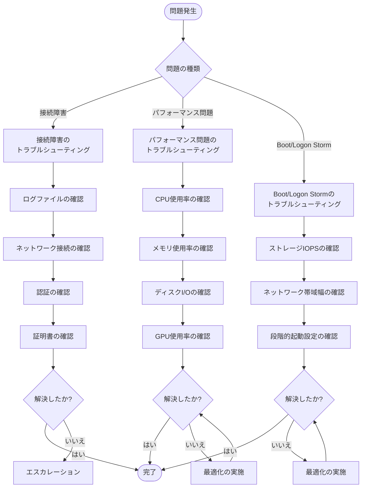

# 4.1 Complex VDI Issues

## 概要

## 関連リソース

- [クイックリファレンス](../../00_Quick_Reference.md) - ポート番号、設定値、制限値、ログファイル
- [用語集](../../README.md#用語集) - 関連用語の定義
- [3.3 Pool Capacity Planning](../../Section3_Monitoring_Optimization/3.3_Pool_Capacity_Planning.md) - 容量計画
- [1.13 GPU Resource Allocation](../../Section1_Infrastructure_Planning_and_Management/1.13_GPU_Resource_Allocation.md) - GPUリソース割り当て
- [実環境シナリオ](../../00_Scenarios/Section4_Scenarios.md) - 実環境でのシナリオ例

複雑なVDI問題のトラブルシューティングは、Horizon環境の安定性と可用性に重要です。OCE-Hレベルでは、接続障害、リソースボトルネック、ストレージI/O問題、GPUリソース割り当て問題、Boot storms、Logon storms、Global Entitlements、グラフィックドライバー問題、Instant cloneデバッグモードの有効化が求められます。

## 接続障害、リソースボトルネック、ストレージI/O問題、GPUリソース割り当て問題のトラブルシューティングと解決

### トラブルシューティングフローチャート



### 接続障害

**一般的な原因**:
- ネットワーク問題
- 認証問題
- Connection Serverの問題
- UAGの問題

**詳細なトラブルシューティング手順**:

1. **ネットワーク接続の確認**
   ```powershell
   # クライアントからConnection Serverへの接続確認
   Test-NetConnection -ComputerName "horizon.contoso.com" -Port 443
   
   # クライアントからUAGへの接続確認
   Test-NetConnection -ComputerName "uag.contoso.com" -Port 443
   
   # DNS解決の確認
   Resolve-DnsName "horizon.contoso.com"
   ```

2. **認証ログの確認**
   ```powershell
   # Connection Serverセキュリティログの確認
   Get-Content "C:\ProgramData\VMware\VDM\logs\vdm-security.log" | 
       Select-String "Authentication" | 
       Select-Object -Last 50
   ```

3. **Connection Serverログの確認**
   ```powershell
   # Connection Serverログの確認
   Get-Content "C:\ProgramData\VMware\VDM\logs\vdm.log" | 
       Select-String "Error" | 
       Select-Object -Last 50
   ```

4. **UAGログの確認**
   ```bash
   # SSH経由でUAGに接続
   ssh admin@<UAG IP>
   
   # ログの確認
   tail -f /opt/vmware/gateway/logs/access.log
   tail -f /opt/vmware/gateway/logs/error.log
   ```

### リソースボトルネック

**CPUボトルネック**:
- 症状: 高いCPU使用率、応答の遅延
- 解決策: CPUリソースの追加、VM密度の調整

**メモリボトルネック**:
- 症状: メモリ不足、ページング
- 解決策: メモリリソースの追加、VMあたりのメモリ割り当ての調整

### ストレージI/O問題

**症状**:
- 高いディスクレイテンシ
- 低いIOPS
- VM起動時間の増加

**詳細なトラブルシューティング手順**:

1. **ストレージIOPSの確認**
   ```powershell
   # vSphere PowerCLIでIOPSを確認
   Get-Stat -Entity (Get-VMHost) -Stat "disk.numberRead.summation", "disk.numberWrite.summation" -Realtime
   ```

2. **ディスクレイテンシの確認**
   ```powershell
   # ディスクレイテンシの確認
   Get-Stat -Entity (Get-VMHost) -Stat "disk.totalLatency.average" -Realtime
   ```

3. **ストレージの最適化**
   - ストレージの分散
   - キャッシングの有効化
   - IOPSの増加

**解決策**:
- ストレージの最適化
- IOPSの増加
- キャッシングの有効化
- ストレージの分散

### GPUリソース割り当て問題

**症状**:
- GPUパフォーマンスの低下
- GPUリソースの不足

**解決策**:
- GPUプロファイルの調整
- GPUリソースの追加
- VM密度の調整

## Boot stormsとLogon stormsの理解

### Boot Storm

**概要**:
- 多数のVMが同時に起動
- ストレージI/Oの急増
- ネットワーク帯域幅の消費

**対策**:
- 段階的なVM起動
- ストレージの最適化
- キャッシングの有効化

### Logon Storm

**概要**:
- 多数のユーザーが同時にログオン
- 認証サーバーの負荷
- プロファイル読み込みの負荷

**対策**:
- ログオン時間の分散
- 認証サーバーの負荷分散
- プロファイルの最適化

> [!WARNING]

> Boot StormとLogon Stormは、Horizon環境のパフォーマンスに大きな影響を与えます。適切な対策が必要です。

## ゲスト内のCPUとメモリボトルネックの特定

### CPUボトルネックの特定

**監視ツール**:
- Windowsタスクマネージャー
- パフォーマンスモニター
- vSphere Client

**症状**:
- CPU使用率が90%以上
- 応答時間の増加

### メモリボトルネックの特定

**監視ツール**:
- Windowsタスクマネージャー
- パフォーマンスモニター

**症状**:
- メモリ使用率が95%以上
- ページングの発生

## 小さすぎるGPUプロファイルが使用された場合の特定

### GPUプロファイルの問題

**症状**:
- GPUパフォーマンスの低下
- アプリケーションのクラッシュ
- グラフィックスの品質低下

**解決策**:
- より大きなGPUプロファイルへの変更
- GPUリソースの追加

## Global Entitlementsのトラブルシューティング（初期設定の依存関係、プロトコル設定など）

### Global Entitlementsの問題

**一般的な問題**:
- 初期設定の不備
- プロトコル設定の不一致
- ポッド間の接続問題

**詳細なトラブルシューティング手順**:

1. **初期設定の確認**
   ```bash
   # CPAの状態確認
   imvutil -c -l
   
   # グローバルエンタイトルメントの確認
   imvutil -c -l -g
   
   # ポッドの状態確認
   imvutil -c -l -p
   ```

2. **プロトコル設定の確認**
   - Horizon Console → View Configuration → Global Settings → Display Protocol
   - 各ポッドで同じ設定であることを確認

3. **ポッド間の接続確認**
   ```powershell
   # ポッド間のネットワーク接続確認
   Test-NetConnection -ComputerName "pod2.contoso.com" -Port 4001
   ```

4. **レプリケーションの確認**
   - Connection Server間のレプリケーション状態を確認
   - ログファイルを確認: `C:\ProgramData\VMware\VDM\logs\vdm-jms.log`

## VMレベルでのグラフィックドライバー問題の特定とトラブルシューティング（GPU、Non-GPU）

### GPUドライバー問題

**症状**:
- グラフィックスの表示不良
- アプリケーションのクラッシュ

**詳細なトラブルシューティング手順**:

1. **ドライバーの確認**
   ```powershell
   # GPUドライバーの確認
   Get-WmiObject Win32_VideoController | Select-Object Name, DriverVersion, DriverDate
   ```

2. **ドライバーの更新**
   - 最新のドライバーをダウンロード
   - ドライバーを更新
   - システムを再起動

3. **ドライバーの再インストール**
   - ドライバーをアンインストール
   - システムを再起動
   - ドライバーを再インストール

**解決策**:
- ドライバーの更新
- ドライバーの再インストール
- vGPUプロファイルの確認
- GPUリソースの確認

### Non-GPUドライバー問題

**症状**:
- 表示の問題
- パフォーマンスの低下

**解決策**:
- ドライバーの更新
- 設定の確認

## Instant cloneデバッグモードの有効化

### デバッグモードの有効化

**レジストリ設定**:
```powershell
# Instant Cloneデバッグモードを有効化
New-ItemProperty -Path "HKLM:\SOFTWARE\VMware, Inc.\VMware VDM\Agent" `
    -Name "InstantCloneDebug" -Value 1 -PropertyType DWord -Force
```

**ログの確認**:
- ログファイル: `C:\ProgramData\VMware\VDM\logs\vdm-instantclone.log`

> [!TIP]

> Instant Cloneデバッグモードを有効にすることで、詳細なログが生成され、問題の特定が容易になります。

## パフォーマンス問題の診断ツール

### 診断ツールの種類

**vSphere Client**:
- パフォーマンスタブでリソース使用率を確認
- リアルタイムメトリック
- 履歴データの分析

**Horizon Console**:
- セッション情報の確認
- パフォーマンスメトリックの確認
- エラーログの確認

**Windowsパフォーマンスモニター**:
- 詳細なパフォーマンスメトリック
- カスタムカウンターの追加
- データコレクターセットの作成

**PowerShellスクリプト**:
```powershell
# パフォーマンス診断スクリプト
$counters = @(
    "\Processor(_Total)\% Processor Time",
    "\Memory\% Committed Bytes In Use",
    "\PhysicalDisk(_Total)\% Disk Time",
    "\Network Interface(*)\Bytes Total/sec"
)

$data = Get-Counter -Counter $counters -SampleInterval 5 -MaxSamples 12
$data | Export-Counter -Path "performance-data.csv" -FileFormat CSV
```

## ネットワーク問題の診断

### ネットワーク診断手順

**接続性の確認**:
```powershell
# 接続性の確認
Test-NetConnection -ComputerName "horizon.contoso.com" -Port 443
Test-NetConnection -ComputerName "uag.contoso.com" -Port 443

# パスMTUの確認
Test-NetConnection -ComputerName "horizon.contoso.com" -Port 443 -InformationLevel Detailed
```

**帯域幅の測定**:
```powershell
# ネットワーク帯域幅の測定
Measure-Command {
    # データ転送テスト
}
```

**レイテンシの測定**:
```powershell
# レイテンシの測定
Test-Connection -ComputerName "horizon.contoso.com" -Count 10 | 
    Measure-Object -Property ResponseTime -Average -Maximum -Minimum
```

## ストレージ問題の診断

### ストレージ診断手順

**IOPSの確認**:
```powershell
# vSphere PowerCLIでIOPSを確認
Get-Stat -Entity (Get-VMHost) -Stat "disk.numberRead.summation", "disk.numberWrite.summation" -Realtime
```

**レイテンシの確認**:
```powershell
# ディスクレイテンシの確認
Get-Stat -Entity (Get-VMHost) -Stat "disk.totalLatency.average" -Realtime
```

**ストレージ使用率の確認**:
```powershell
# データストアの使用率を確認
Get-Datastore | Select-Object Name, @{Name="UsedGB";Expression={[math]::Round($_.UsedSpaceGB,2)}}, @{Name="FreeGB";Expression={[math]::Round($_.FreeSpaceGB,2)}}, @{Name="PercentUsed";Expression={[math]::Round(($_.UsedSpaceGB/$_.CapacityGB)*100,2)}}
```

## GPU問題の診断

### GPU診断手順

**GPU使用率の確認**:
- vSphere Client → ホスト → モニタリング → パフォーマンス
- GPU使用率、GPUメモリ使用率を確認

**GPUドライバーの確認**:
```powershell
# GPUドライバーの確認
Get-WmiObject Win32_VideoController | Select-Object Name, DriverVersion, DriverDate, Status
```

**vGPUプロファイルの確認**:
- vSphere Client → VM → Edit Settings → vGPU
- 割り当てられているvGPUプロファイルを確認

## ログファイルの詳細な分析手順

### ログ分析のベストプラクティス

**ログファイルの場所**:
- Connection Server: `C:\ProgramData\VMware\VDM\logs\`
- UAG: `/opt/vmware/gateway/logs/`
- Agent: `C:\ProgramData\VMware\VDM\logs\`

**ログ分析スクリプト**:
```powershell
# エラーログの分析
$logFiles = Get-ChildItem "C:\ProgramData\VMware\VDM\logs\*.log"

foreach ($logFile in $logFiles) {
    $errors = Get-Content $logFile.FullName | Select-String "Error" | Select-Object -Last 20
    if ($errors) {
        Write-Host "Errors in $($logFile.Name):"
        $errors | ForEach-Object { Write-Host "  $_" }
    }
}
```

## ベストプラクティス

1. **プロアクティブな監視**
   - 定期的なパフォーマンス監視
   - ボトルネックの早期発見
   - 診断ツールの使用

2. **ログの分析**
   - ログファイルの定期的な確認
   - エラーパターンの特定
   - 自動化されたログ分析

3. **テスト環境**
   - テスト環境での検証
   - 本番環境への適用
   - トラブルシューティング手順の文書化

4. **ドキュメント**
   - トラブルシューティング手順の文書化
   - よくある問題と解決策の記録
   - 変更履歴の管理

## 理解度チェックリスト

以下の項目について理解度を確認してください：

### Boot StormとLogon Storm
- [ ] Boot Stormの概念と影響を説明できる
- [ ] Logon Stormの概念と影響を説明できる
- [ ] Boot StormとLogon Stormの対策を理解している

### ボトルネックの特定
- [ ] ゲスト内のCPUボトルネックを特定できる
- [ ] ゲスト内のメモリボトルネックを特定できる
- [ ] ストレージI/O問題を特定できる
- [ ] GPUリソース割り当て問題を特定できる

### トラブルシューティング
- [ ] 接続障害のトラブルシューティング手順を理解している
- [ ] 小さすぎるGPUプロファイルが使用された場合の識別方法を説明できる
- [ ] Global Entitlementsのトラブルシューティング方法を理解している
- [ ] VMレベルでのグラフィックドライバー問題の特定と解決方法を説明できる
- [ ] Instant Cloneデバッグモードの有効化方法を理解している

### 診断ツール
- [ ] パフォーマンス診断ツールの使用方法を理解している
- [ ] ログファイルの分析方法を説明できる

## まとめ

複雑なVDI問題のトラブルシューティングは、Horizon環境の安定性と可用性に重要です。適切なトラブルシューティング手順とツールの使用、詳細なログ分析、パフォーマンス診断ツール、ネットワーク・ストレージ・GPU問題の診断により、問題を迅速に特定し、解決できます。
