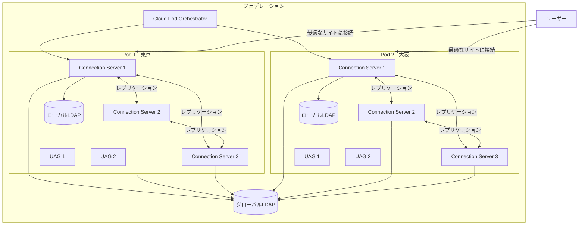

# 6.2 Cloud Pod Architecture

## 概要

## 関連リソース

- [クイックリファレンス](../../00_Quick_Reference.md) - ポート番号、設定値、制限値
- [用語集](../../README.md#用語集) - 関連用語の定義
- [1.6 Pod/Farm Architecture](../../Section1_Infrastructure_Planning_and_Management/1.6_Pod_Farm_Architecture.md) - Pod/Farmアーキテクチャ
- [2.3 Entitlements](../../Section2_Desktop_Application_Profile_Management/2.3_Entitlements.md) - エンタイトルメント
- [実環境シナリオ](../../00_Scenarios/Section6_Scenarios.md) - 実環境でのシナリオ例

Cloud Pod Architecture (CPA)は、複数のHorizonポッドを統合管理するアーキテクチャです。OCE-Hレベルでは、CPAの初期化、Podの参加、Global Entitlementの設定、Home Site戦略、Imvutilコマンドの使用が求められます。

## Cloud Pod Architectureの初期化

### CPAアーキテクチャ図



### 初期化手順

1. **Horizon Consoleでの操作**
   - View Configuration → Cloud Pod Architecture
   - Initialize Cloud Pod Architectureをクリック

2. **初期設定**
   - フェデレーション名の設定
   - グローバルLDAPインスタンスの設定

**詳細な初期化手順**:

1. **前提条件の確認**
   - すべてのConnection Serverが同じバージョン
   - ネットワーク接続の確認
   - ファイアウォールルールの確認

2. **初期化の実行**
   - Horizon Console → View Configuration → Cloud Pod Architecture
   - Initialize Cloud Pod Architectureをクリック
   - フェデレーション名を入力（例: "Global-Horizon-Federation"）

3. **グローバルLDAPインスタンスの設定**
   - グローバルLDAPサーバーのFQDNまたはIPアドレス
   - ポート番号（デフォルト: 389/636）
   - 認証情報

4. **初期化の検証**
   - CPAの状態を確認
   - ログファイルを確認

> [!IMPORTANT]
> CPAの初期化は、最初のポッドで一度だけ実行します。

## Horizon ConsoleでPodをPod Federationに参加

### Podの参加手順

1. **Horizon Consoleでの操作**
   - View Configuration → Cloud Pod Architecture
   - Join Pod to Federationをクリック

2. **参加情報の入力**
   - 既存のフェデレーションの情報
   - 認証情報

## グローバルLDAPインスタンスとローカルLDAPインスタンスの目的の比較

### グローバルLDAPインスタンス

**目的**:
- フェデレーション全体で使用
- グローバルエンタイトルメントの管理
- ユーザー認証

### ローカルLDAPインスタンス

**目的**:
- 各ポッドで使用
- ローカルエンタイトルメントの管理
- ポッド固有の設定

> [!TIP]
> グローバルLDAPとローカルLDAPの違いを理解することで、適切な設定が可能になります。

## Horizon ConsoleでGlobal Entitlementにプールを追加

### Global Entitlementの設定

**手順**:
1. Horizon Console → Inventory → Global Entitlements
2. Global Entitlementを選択
3. Add Poolをクリック
4. プールを選択

## ユーザー位置のHome Site戦略の実装

### Home Siteの設定

**Imvutilコマンド**:
```bash
# Home Siteの設定
imvutil -c -s -u username -h pod-name
```

**利点**:
- レイテンシの最小化
- データの局所性
- ネットワーク帯域幅の最適化

## Horizon ConsoleとImvutilコマンドを使用したCloud Pod Architecture環境の変更と維持

### Imvutilコマンドの概要

**Imvutilの場所**:
- Connection Serverにインストールされる
- パス: `C:\Program Files\VMware\VMware View\Server\tools\bin\imvutil.exe`

**実行要件**:
- Connection Serverで実行
- 管理者権限
- コマンドプロンプトまたはPowerShell

### 主要なImvutilコマンド

#### CPAの状態確認

**コマンド**:
```bash
# CPAの全体的な状態を確認
imvutil -c -l

# 詳細な情報を表示
imvutil -c -l -v
```

**出力例**:
```
Federation Name: Horizon-Federation
Federation ID: fed-123456
Pods: 2
Global Entitlements: 5
```

#### グローバルエンタイトルメントの一覧

**コマンド**:
```bash
# すべてのグローバルエンタイトルメントを一覧表示
imvutil -c -l -g

# 特定のグローバルエンタイトルメントの詳細
imvutil -c -l -g -n "Global-Entitlement-Name"
```

**出力例**:
```
Global Entitlement: Global-Entitlement-Dev
  ID: ge-123456
  Pools: 3
  Users: 100
```

#### ポッドの一覧

**コマンド**:
```bash
# すべてのポッドを一覧表示
imvutil -c -l -p

# 特定のポッドの詳細
imvutil -c -l -p -n "Pod-Name"
```

**出力例**:
```
Pod: Pod-Tokyo
  ID: pod-123456
  Connection Servers: 3
  Status: Connected
```

#### Home Siteの設定

**コマンド**:
```bash
# ユーザーのHome Siteを設定
imvutil -c -s -u username -h pod-name

# 例
imvutil -c -s -u contoso\jsmith -h Pod-Tokyo
```

**一括設定**:
```bash
# CSVファイルから一括設定
# users.csvの形式:
# username,pod-name
# contoso\jsmith,Pod-Tokyo
# contoso\jdoe,Pod-NewYork

# PowerShellスクリプトで一括実行
$users = Import-Csv "users.csv"
foreach ($user in $users) {
    imvutil -c -s -u $user.username -h $user.'pod-name'
}
```

#### Global Entitlementの管理

**コマンド**:
```bash
# Global Entitlementにプールを追加
imvutil -c -a -g "Global-Entitlement-Name" -p "Pool-Name"

# Global Entitlementからプールを削除
imvutil -c -r -g "Global-Entitlement-Name" -p "Pool-Name"
```

#### ポッドの管理

**コマンド**:
```bash
# ポッドの状態を確認
imvutil -c -l -p -n "Pod-Name"

# ポッドの設定を更新
imvutil -c -u -p "Pod-Name" -s "Setting-Value"
```

> [!NOTE]
> Imvutilコマンドを使用することで、CPA環境の詳細な管理が可能になります。コマンドの実行前に、必ずバックアップを取得してください。

### Horizon Consoleでの管理

#### CPA設定の確認

**手順**:
1. Horizon Console → View Configuration → Cloud Pod Architecture
2. フェデレーション情報を確認
3. ポッドの状態を確認

#### Global Entitlementの管理

**手順**:
1. Inventory → Global Entitlements
2. Global Entitlementを選択
3. Poolsタブでプールを追加/削除
4. Entitlementsタブでユーザー/グループを管理

### トラブルシューティング

#### 一般的な問題

**ポッドが接続されない**:
- ネットワーク接続の確認
- ファイアウォールルールの確認
- 認証情報の確認

**Global Entitlementが機能しない**:
- プールがGlobal Entitlementに追加されているか確認
- エンタイトルメントの確認
- プロトコル設定の確認

## ベストプラクティス

1. **計画**
   - 適切なCPA設計
   - ネットワーク要件の考慮

2. **管理**
   - 定期的な監視
   - 設定のドキュメント化

## 理解度チェックリスト

以下の項目について理解度を確認してください：

### CPA初期化
- [ ] Cloud Pod Architectureの初期化手順を理解している
- [ ] グローバルLDAPインスタンスの設定方法を説明できる
- [ ] 初期化の前提条件を理解している

### Pod参加
- [ ] Horizon ConsoleでPodをPod Federationに参加させる手順を説明できる
- [ ] 参加時の注意事項を理解している

### Global Entitlement
- [ ] グローバルLDAPインスタンスとローカルLDAPインスタンスの目的の違いを説明できる
- [ ] Horizon ConsoleでGlobal Entitlementにプールを追加する手順を理解している
- [ ] Global Entitlementのトラブルシューティング方法を説明できる

### Home Site戦略
- [ ] ユーザー位置のHome Site戦略の実装方法を理解している
- [ ] ImvutilコマンドでHome Siteを設定する方法を説明できる

### CPA管理
- [ ] Horizon ConsoleとImvutilコマンドを使用したCPA環境の変更とメンテナンス方法を理解している
- [ ] CPA環境でのトラブルシューティング方法を説明できる

## まとめ

Cloud Pod Architectureの適切な実装と管理は、複数サイトの統合管理に重要です。初期化、Podの参加、Global Entitlementの設定、Home Site戦略、Imvutilコマンドの使用により、効率的でスケーラブルなHorizon環境を構築できます。
